## 正态分布
* 独立和不相关的区别
  - 独立一定不相关，不相关不一定独立
  - 对于均值为零的高斯随机变量，独立和不相关等价
  - 不相关就是两者没有线性关系
* 独立随机变量的均数和方差加减的计算
  - 和的方差等于方差的和
  - 差的方差等于方差的差  

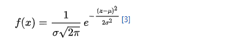

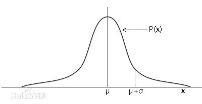

## 马尔可夫不等式(Markov's inequality)
假设Z是一个非负的随机变量：


* 随机变量??
* E(X)是关于X的增函数

```
P(Z≥t) == ∑(pi), i≥t
E[Z]/t == ∑(pi*Zi)/t,i≥0
```
## 切比雪夫不等式(chebyshev's inequality)

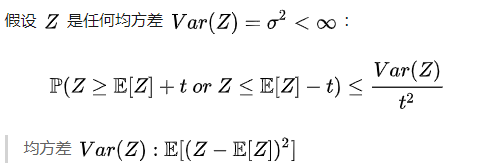


## 矩量母函数(Moment Generatiing Function,动差生成函数)
* 我们称 `exp(tξ)`的数学期望为随机变量ξ的矩量母函数，记作 `mξ(t) = Ε[exp(tξ)]`  
* 连续型随机变量 `ξ` 的MGF为：`mξ(t) = ∫exp(tx)f(x)dx`,积分区间为(-∞,+∞),f(x)是 `ξ` 的概率密度函数
* 离散型随机变量 `ξ` 的MGF为：`mξ(t) = ∑exp(tx)p(ξ=x)` 
* 矩量母函数存在当且仅当上述积分极限存在

* 示例
  * 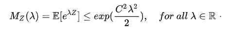
  * 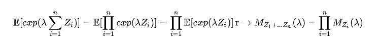
  * 

## 切尔诺夫边界(chernoff bounds)

定义Z的矩量母函数：`Mz(λ):=E[exp(λZ)]`  
切尔诺夫边界使用矩量母函数作为一种必要的方法来给出*指数偏差界限*  
证明过程  
1. 马尔可夫不等式
  - t >0  
  - 利用函数单调性，两边乘t再取指数
  - 根据马尔可夫不等式得到最右边  
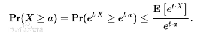

2. 假设n个随机变量X1...Xn,t>0
  - `X =  ∑ Xi`  
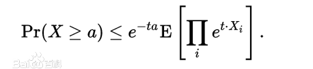

3. 优化`t`并使用`Xi`独立的假设  
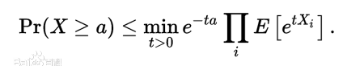

4. 替换矩量母函数  
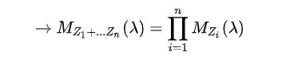


当我们要计算一些独立同分布变量和的切尔诺夫界时，只需要计算这些变量中的一个矩量母函数  
假设Zi 都是i.i.d,并且为了简化，假设均值为0，可以得到  
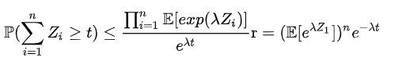

## 大数定理
设随机变量 `X1,X2,...,Xn,...`互相独立，并且具有相同的期望 `μ` 和方差 `σ2`。  
对于前n个随机变量的平均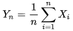,  
则有任意正数`ε`,有 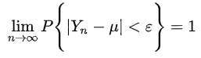

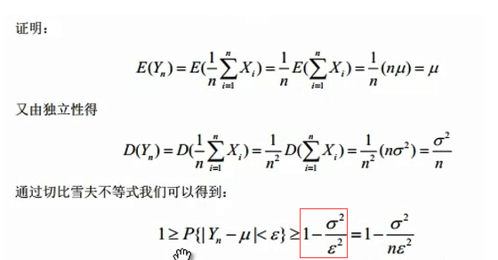   
红框去掉

意义：说明当n很大时，随机变量`X1,X2,...,Xn,...`的平均值`Yn`在概率意义下无限接近期望`μ`

## 霍夫丁不等式

### 霍夫丁引理

* 对于随机变量`X,P(X∈[a,b])=1,E(X)=0`,有  
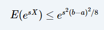

* 证明
 1. `e^(sX)`是关于X的凸函数，由凸函数性质:  
 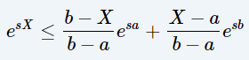

 2. 对 X 取期望：  
 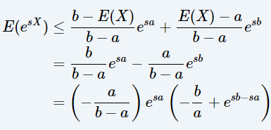

 3. 因为`E(X)=0`,所以`a<0,b>0`,令  
 有  
 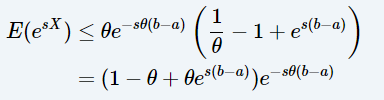  

 4. 因为：  
 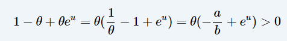     
 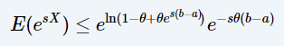
   
 5. 令`u=s(b-a)`:  
   

 6. 定义，良定义   
 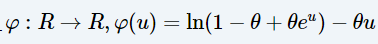     
 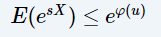 

 7. 由泰勒中值定理,`∃ξ∈[0,u]`,使  
 `φ(u)=φ(0)+uφ′(0)+1/2u^2φ′′(ξ)`    
 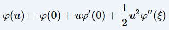    
 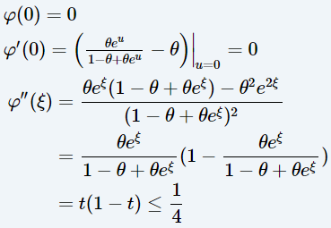   
 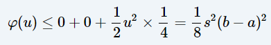   

 8. 证明


### 霍夫丁不等式

样本和总体中某件事发生的概率

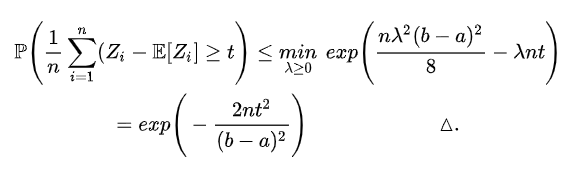

* 最后一步证明：求导，或抛物线最低点

* [参考](https://www.cnblogs.com/qizhou/p/12843557.html)