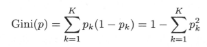

## 
决策树

### 基本流程

### 划分选择
* 信息增益
  - 信息熵 

  

  - pk 当前样本集合D中第k类样本所占的比例
  
  - 信息增益

  

  - 属性a有V个可能的取值{a1,a2,...,aV}
  - 选择 a* = arg max Gain(D,a) a∈A

* 增益率
  
  

  - IV(a) 称为属性a的“固有值”

* 基尼指数
  - Gini(D)越小，则数据集D的纯度越高

  

  - 属性a的基尼指数

  

  - a* = arg min Gini_index(D,a) a∈A

### 剪枝处理
  * 预剪枝
    - 基于信息增益准则，对划分前后的泛化性能进行估计
    - 如果剪枝后精度下降，就拒绝剪枝，变为叶节点(包含最多的)
  * 后剪枝
    - 先生成一颗完整的决策树
    - 从后往前进行完整的决策

### [连续与缺失值](./gain.cpp)
  * 划分

  
  
  * 信息增益

  

  * 缺失值处理

  

  

### 多变量决策树
  * 对属性的线性组合进行测试