## 
神经网络

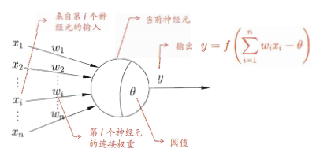

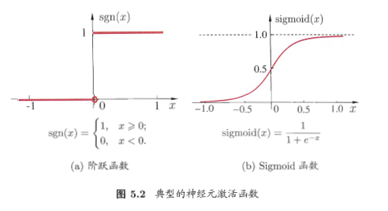

### 概念
- 阶跃函数 y=1/(1+e^-x)
- y=f(∑i(wixi)-θ)

### 感知机与多层网络
 - 感知机 - 由两层神经元
    
    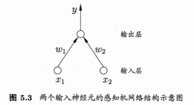 

 	- 对于训练样例(x,y) 
	  * wi ← wi + Δwi
	  * Δwi = η(y-y')xi  y'为当前感知机的输出
	- 若两类模式是线性可分的，即存在一个线性超平面能将它们分开，则感知机的学习过程一定收敛，而求得适当的权向量 w(w1;w2;...;wn+1);否则感知机学习过程将会发生振荡，解决非线性可分问题，考虑使用多层功能神经元
     
    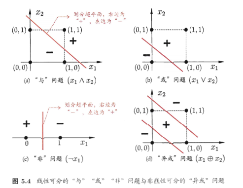

 * 多层网络
    - 输入层与输出层之间的一层神经元被称为隐层或隐含层  
      隐含层和输出层神经元都是拥有激活函数的功能神经元

    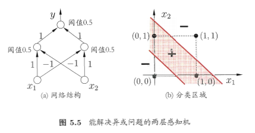

    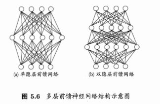

    - 只需包含隐层，即可为多层网络
    - 神经网络学习过程，就是根据训练数据来调整神经元之间的'连接权'以及每个功能神经元的阈值

*  误差逆传播算法(BP算法，大多数指 多层前馈神经网络)
    
    

    - 输出层第j个神经元的阈值用θj表示
    - 隐层第h个神经元的阈值用rh表示
    - bh是隐层第h个神经元的输出

    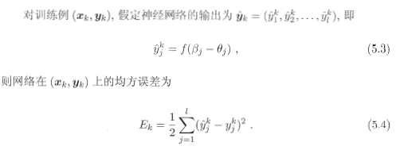
    
    - (d+l+1)* q+l个参数需要确定
      - 输入层 d x q 个权值
      - 隐层到输出层 q x l 个权值
      - q 个隐层神经元的阈值
      - l 个输出层神经元阈值
    - 迭代每一轮中采用广义的感知机学习规则对参数进行更新评估  
      `v ← v + △v`
    - 学习率 给定学习率 η，有

      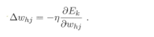

      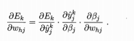

      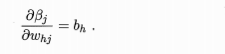
    
    - sigmoid函数性质

      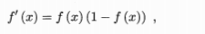

      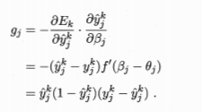

      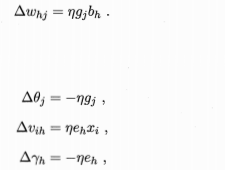

      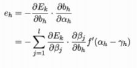

      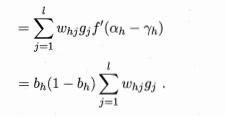

    - 算法

      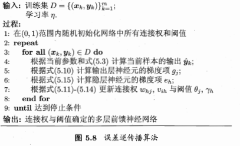

    - 目标：最小化训练集D上的累计误差 

      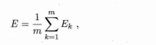

    - 累积BP算法
    - 标准BP算法

    - 防止过拟合
      * 早停：将数据分为训练集和验证集，训练集用来计算梯度、更新连接权和阈值，验证集用来估计误差，若训练集误差降低但验证集误差升高，则停止训练，同时返回具有最小验证集误差的连接权和阈值
      * 正则化： 误差目标函数改为

      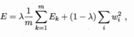

### 其他常见神经网络
   * RBF(Radial Basis Function,径向基函数)
     - q 为隐层神经元个数，ci和wi分别是第i个隐层神经元所对应的中心和权重，ρ(x,ci)是径向基函数
     - 第一步：确定神经元中心ci,常用随机采样、聚类等，第二步：利用BP算法等来确定wi和βi

   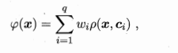

   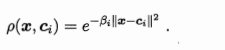

   * ART网络(Afaptive Resonance Theory,自适应谐振理论)
     - 该网络有比较层，识别层，识别阈值和重置模块构成

   * SOM网络(self-organizing map,自组织映射)

   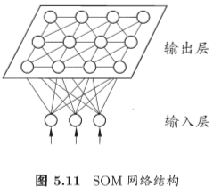

   * 级联相关网络
     - 结构自适应网络

   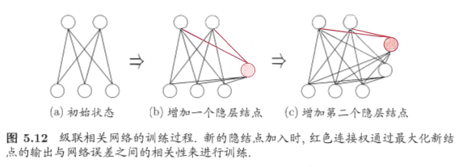

   * Elman网络

   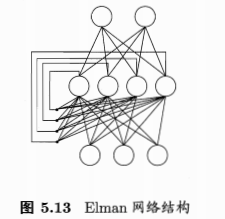

   * Boltzmann机
     - s∈{0,1}^n表示n个神经元的状态，0抑制 1 激活
     - wij 表示神经元i与j之间的连接权
     - θi表示神经元i的阈值

   

   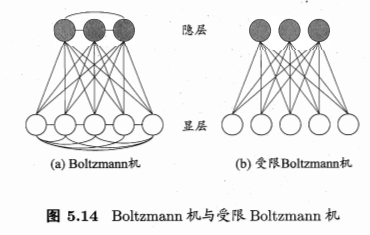

   

     - 隐层神经元状态的概率分布 v显层 h隐层
      
   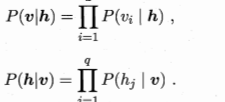

     - 连接权更新公式

   

### 深度学习

* 预训练+微调
* 权共享

·························

* 卷积神经网络(CNN)

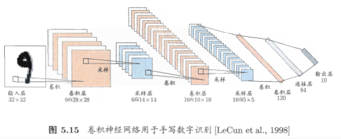