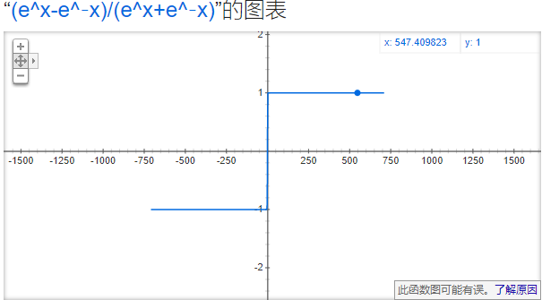
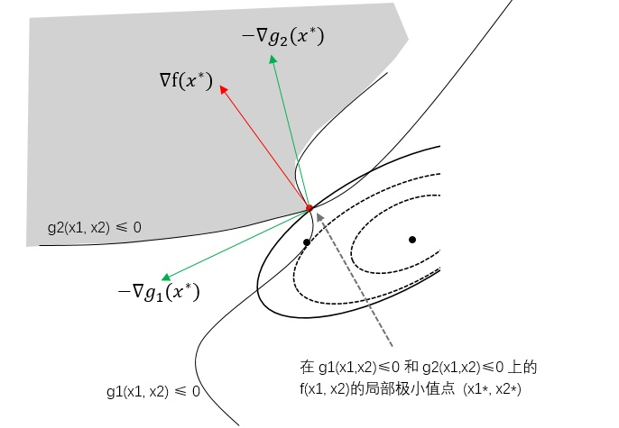

### 基本概念

* 正定矩阵
  - 给定一个大小为n X n的实对称矩阵 A，若对于任意长度为n的非零向量x,有 x^TAx＞0恒成立，则矩阵A是一个正定矩阵

* 半正定矩阵
  - 给定一个大小为n X n的实对称矩阵 A，若对于任意长度为n的向量x,有 x^TAx≥0恒成立，则矩阵A是一个半正定矩阵 

* 再生核希尔伯特空间

* 双曲正切函数 
  - tanhx=sinhx/coshx = (e^x-e^-x)/(e^x+e^-x)

  

* 拉格朗日对偶

  

  - KKT条件(有不等式的约束)
    - μ1≥0，μ2≥0
    - ▽f(x* )+μ1▽g1(x* )+μ▽g2(x* )=0
    - μ1g1(x* )+ μ2g2(x* )=0
