## 
支持向量机

### [基本概念](./OTHER.md)

### 间隔与支持向量 

* 训练样本集
  -  D={(x1,y1),(x2,y2),...,(xm,ym)}
  -  yi ∈{-1,+1}

  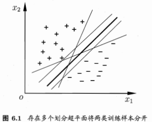

  - 线性方程 `ω^Tx + b = 0`
  - 样本空间任意点x到超平面(ω,b)的距离  
    `r=|ω^Tx+b|/||ω||`

  - 支持向量

  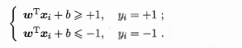

  - 间隔 `γ = 2/||ω||`

  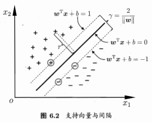

  - 最大间隔

  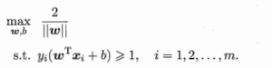 

  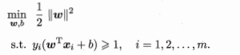

### 对偶问题
  * 使用拉格朗日乘子法得到其 "对偶问题"
  
  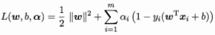

  * α = (α1;α2;...;αm)

  * 令L(ω,b,α) 对ω和b的骗到为零可得

  

  * 上式带入代数方程

  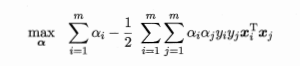

  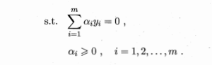

  * 模型

  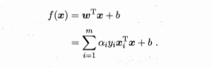

  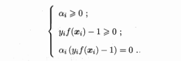

  * 求解模型
    - SMO 选取一对需更新的变量αi和αj;
    - 固定αi和αj以外的参数，求解对偶问题获得更新后的αi和αj
    - 仅考虑αi和αj时，约束可重写为 

    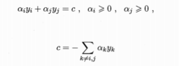

    - 消去 αj，得到一个关于αi的单变量二次规划问题，仅有的约束是 αi≥0

    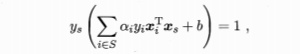

    

### 核函数

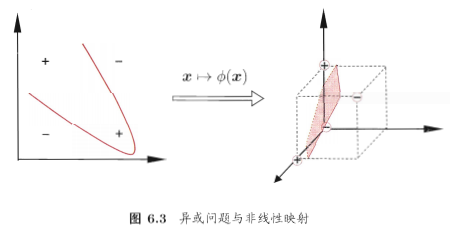

* 对非线性可分
* 如果原始空间是有限维，即属性数有限，那么一定存在一个高维特性空间使样本可分
* 令Φ(x)表示将x映射后的特征向量

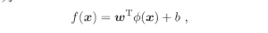

* 对偶问题

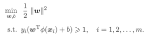

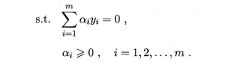

* 核函数

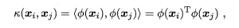

* 重写对偶问题

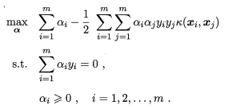

* 求解

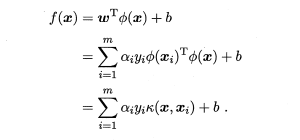

* 定理(核函数)  
  令Χ为输入空间，k(.,.)是定义在Χ x Χ 上的对称函数，则k是核函数当且仅当对于任意数据D={x1,x2,...,xm}，"核矩阵"(kernel matrix) K 总是半正定的

  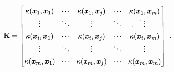

* 只要一个对称函数所对应的核矩阵半正定，它就能做为核函数使用  
  对于一个半正定核矩阵，总能找到一个与之对应的映射Φ  
  任何一个核函数都隐式定义了一个称为“再生核希尔伯特空间”(Reproducingg Kernel Hilbert Space,RKHS)的特征空间

* 常用核函数
  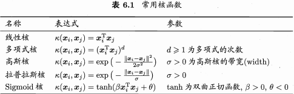

  - 若k1和k2为核函数，则对于任意正数γ1、γ2，其线性组合`γ1k1+γ2k2`也是核函数
  - 若k1和k2为核函数，则核函数的直积 `k1 x k2(x,z) = k1(x,z)k2(x,z)` 也是核函数
  - 若k1为核函数，则对任意函数g(x),`k(x,z)=g(x)k1(x,z)g(z)`也是核函数

### 软间隔与正则化
* 允许支持向量机在一些样本上出错,允许某些样本不满足 `yi(ω^Txi + b)≥1`

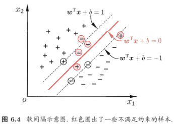

* 优化目标 

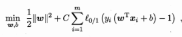

* 其中 C ＞ 0 是一个常数，L0/1 是 “0/1损失函数”

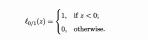

  - 当 C为无穷大时，会使所有样本都满足约束，
  - 当C取有限值时，允许一些样本不满足约束

* 替代损失

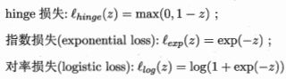

* 采用 hinge损失 

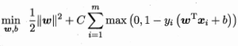

* 引入“松弛变量”(slack variables) ζi≥0, 软间隔支持向量机

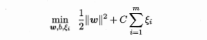

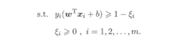

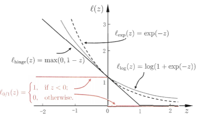

* 拉格朗日乘子法,其中αi≥0，μi≥0是拉格朗日乘子

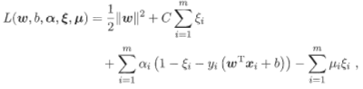

* 令L(ω,b,α,ζ,μ)对ω,b,ζi的偏导为0可得

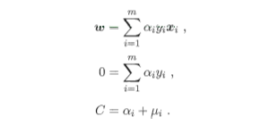

* 将上式求解带入拉格朗日函数可得 

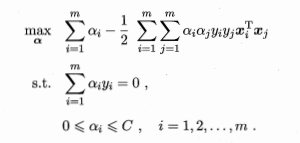

* 软间隔支持向量机

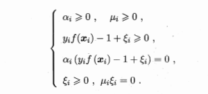

* 更一般的形式  

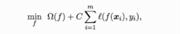

  - Ω(f) 称为 “结构风险” ，用于描述模型f的某些性质，正则化项
  - 第二项 称为 "经验风险"，用于描述模型与训练数据的契合程度
  - C用于对二者进行析中，正则化常数 

### 支持向量回归

* 支持向量回归(Support Vector Regression,SVR) 假设我们能容忍f(x)与y之间最多有ε的偏差，即仅当f(x) 与 y 之间的差别绝对值大于ε时才计算损失

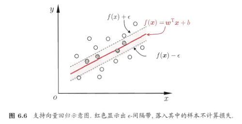

* SVR问题可形式化为

* C 为正则化常数，lε是上图所示的ε不敏感损失函数

* 引入松弛变量ζi和ζ'i

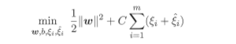

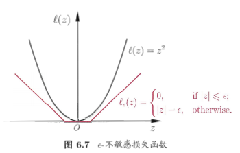

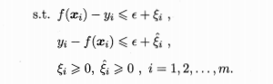

* 引入拉格朗日乘子 μi≥0，μi'≥0，αi≥0，αi'≥0，可得拉格朗日函数

* 将 f(xi) = ωT* xi+b带入拉格朗日函数，对ω，b,ζi,ζi'偏导为0，可得

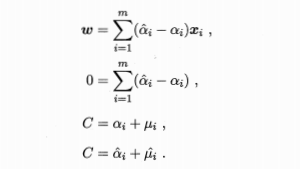

* 将解带入拉格朗日函数，得

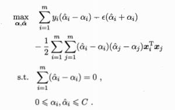

* 上式满足KKT条件

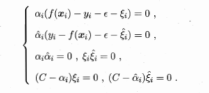

* SVR的解

* 能使上式中的(αi'-αi)≠0的样本即为SVR的支持向量，他们必落在 ε 间隔带之外