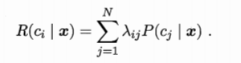
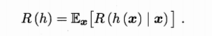
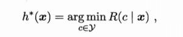
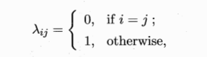
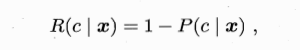

## 
贝叶斯分类器

### 贝叶斯决策论

* 假设有N种可能的类别标记，即 y={c1,c2,...,cN},λij是将一个真实标记为cj的样本误分类为ci所产生的损失。

* 任务：寻找一个判定准则h:X → Y 以最小化总体风险

* 贝叶斯判定准则(Bayes decision rule):为最小化总体风险，只需在每个样本上选择那个能使条件风险R(c|x)最小类别标记,其中
   - h* 称为贝叶斯最优分类器，
   - 与之对应的总体风险 R(h* )称为贝叶斯风险
   - 1 - R(h* )反应了分类器所能达到的最好性能

* 若目标是最小化分类错误率，则误判损失 λij可写为

* 此时条件风险 

* 最小化分类错误率的贝叶斯最优分类器为

### 极大似然估计

### 朴素贝叶斯分类器

### 半朴素贝叶斯分类器

### 贝叶斯网

### EM算法