## 
决策树

### 信息增益
* 特征A对训练数据集D的信息增益g(D,A),定义为集合D的经验熵H(D)与特征A给定条件下D的经验条件熵H(D|A)之差,即

`g(D,A) = H(D) - H(D|A)`

* 熵  
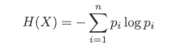  
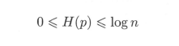  
* 条件熵  
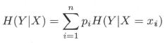  

* 决策树学习应用信息增益准则选择特征
* 计算每个特征的信息增益,并比较它们的大小,选择信息增益最大的特征

### 信息增益比
* 特征A对训练数据集D的信息增益比gR(D,A)定义为其信息增益g(D,A)与训练数据集D关于特征A的值的熵HA(D)之比  
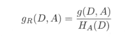  
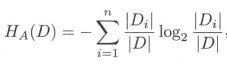

* n是特征A取值的个数

## 决策树的生成

### ID3算法
* 输入：训练数据集D，特征集A阈值 `ε`  
* 输出：决策树T  
* 步骤
  1. 若D中所有实例属于同一类Ck,则T为单节点树，并将类Ck作为该结点的类标记,返回T
  2. 若A=∅,则T为单节点树,并将D中实例数最大的类Ck作为该节点的类标记,返回T
  3. 否则,算出各个特征对D的信息增益,选择信息增益最大的特征Ag
  4. 如果Ag的信息增益小于阈值`ε`,则设置T为单节点树,并将D中实例数最大的类Ck作为该节点的类标记,返回T
  5. 否则,对Ag的每一可能值ai,依Ag=ai 将D分隔为若干非空子集Di,将Di中实例数最大的类作为标记,构建子节点，由节点及其子节点构成树T,返回T
  6. 对第i个子节点,以Di为训练集,以A-{Ag}为特征集,递归地调用步(1)~(5),得到子树Ti,返回Ti

* 注意
  - 只有树的生成,所以该算法生成的树容易产生过拟合

### C4.5
* 使用信息增益比

## 决策树的剪枝
* 决策树学习的损失函数定义为   
   
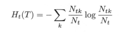   
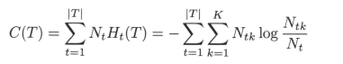   
   

### CART算法

* 回归树的生成
  * 将输入空间划分为M个单元R1,R2,...,RM,并且在每个单元Rm上有一个固定的输出值cm,回归树模型可表示为   
  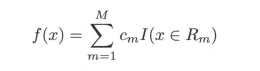   

  * 可以使用平方误差来表示回归树对训练数据的预测误差  
  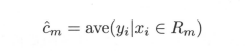    
  *  单元Rm上的cm的最优值是Rm上的所有输入实例xi对应的输出yi的均值  
     
  * 启发方法，分两类  
  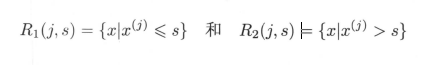   
  * 求解  
  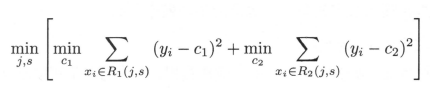    
  * 对固定的输入变量j，可以找到最优切分点  
  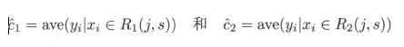   
  * 最小二乘回归树生成算法
* 分类树的生成
  * 基尼指数
    - 分类问题中，假设有K个分类,样本点属于第k类的概率为pk,则概率分布的基尼指数定义为  
    
    - 对于给定的样本集合D,其基尼指数为  
      
    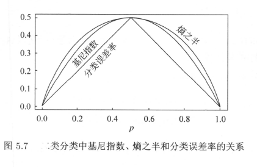
  * CART生成算法(分类树生成算法?)
* CART剪枝
  * 首先从生成算法产生的决策树T0低端开始不断剪枝,知道T0的根节点,形成一个子树序列{T0,T1,...,Tn}
  * 然后通过交叉验证法在独立的验证集上对子树进行测试,从中选择最优子树
  * 分析
    - 从整体树T0开始剪枝。对To的任意内部节点t,以t为单节点树的损失函数是  
    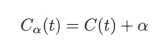
    - 以t节点为根节点的子树Tt的损失函数是  
    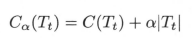  
    - 当α=0及α充分小时,有不等式  
    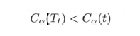   
    - 定义g,表示剪枝后整体损失函数减少的程度   
    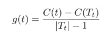   
    - 在To中剪去g(t)最小的子树,作为T1，同时将最小的g(t)设为α1。T1为区间[α1,α2)的最优子树
    - 剪枝下去,直到得到根节点
  * 交叉验证
    - 测试子树序列T0,T1,...,Tn中各颗子树的平方误差或基尼指数最小的决策树被认为是最优的决策树  
    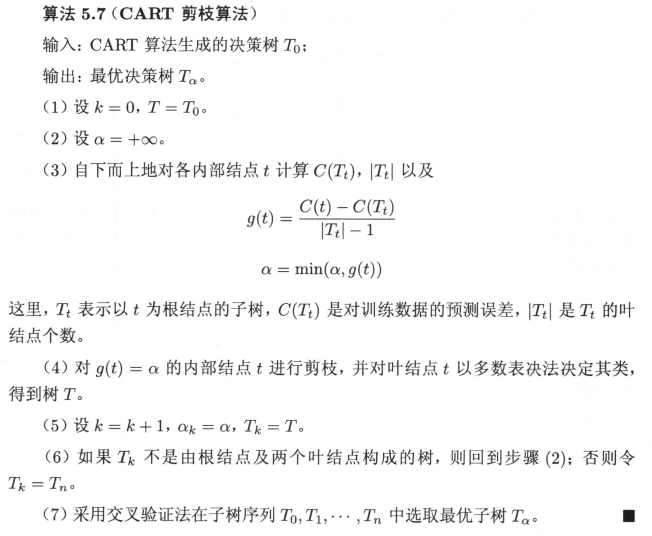  