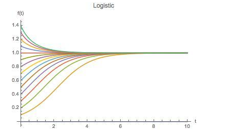
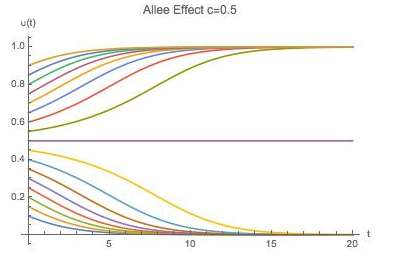
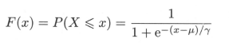
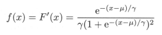
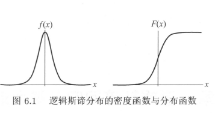
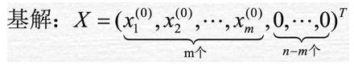
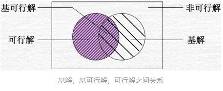
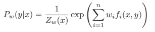
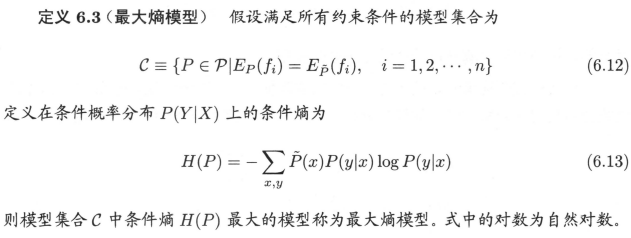

## 
logistic 和  最大熵模型

### logistic
* 源自生态学 
  - `dN(t)/dt = rN(t) --> N(t) = N0e^(rt)`
  - `dN(t)/dt = rN(t)(1-N(t)/K)`
    - 令`f(t) = N(t)/K`
    - `df(t)/dt = rf(t)(1-f(t))`
    - `f(t) = f0 e^(rt)/(1+f0(e^(rt)-1))`  
    
  - `df(t)/dt = rf(t)(1-f(t))(f-c)` `c`为阈值    
    

* 统计学(在某个范围内变化剧烈)
  - 分布  
    
  - 密度函数  
  
  - 图形
  
  - F(x)关于(μ,1/2) 中心对称   
    `F(-x+μ)-1/2 = -F(x+μ)+1/2`

### 最大熵模型
- [单纯型](https://zhuanlan.zhihu.com/p/31644892)
  - 若线性规划存在可行域,则可行域为凸集
  - 线性规划的基可行解对应于可行域的顶点
  - 若线性规划有解,则一定存在基可行解为最优解
  - 基解   
      
    

- 最大熵原理选择最好的分类模型
  - 公式  
    
    
  - 对偶函数极大化等价于最大熵模型的极大似然估计
  - 最大熵模型   
  
  - 最大熵模型的学习
  