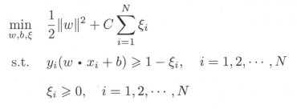
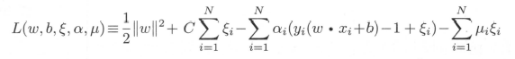
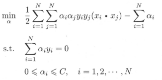
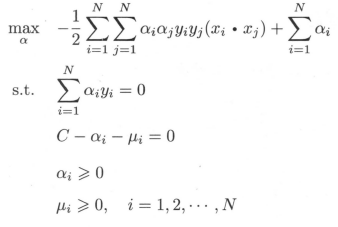
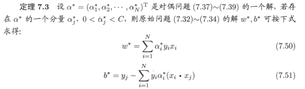
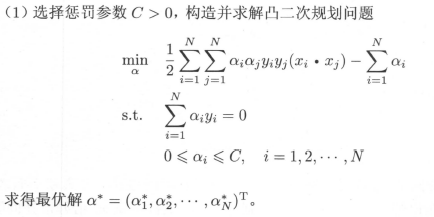
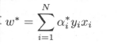
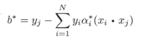
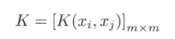

## 
支持向量机

### 线性不可分

* 原始问题(`C>0`)

* 原始问题拉格朗日函数(`αi≥0,μi≥0`)

* 线性支持向量机
  - `ω* · x + b* = 0`
  - `f(x) = sign(ω* · x + b*)`

* 对偶问题
   

* 定理

* 线性支持向量机学习算法
  - 输入
    - 训练数据集 `T={(x1,y1),(x2,y2),...,(xN,yN)},其中xi∈χ = Rn,yi∈Y = {-1，+1},i=1,2,...,N`
  - 输出
    - 分离超平面和分类决策函数 
  - 过程
    - 选择惩罚参数 C>0,构造并求解凸二次规划问题  
    
    - 计算w*  
    
    - 选择`α*`的一个分量`α*j`适合条件 `0<α*j<C`,计算  
    
    - 求得结果(分离超平面和分类决策函数)  
    

### 非线性支持向量机与核函数
* Gram矩阵
  特征空间中 `x1,x2,...,xn` 两两相乘的矩阵
  `G(i,j) = (xi · xj)` xi与xj内积

* 正定矩阵
  给定一个大小为nXn的实对称矩阵A，若对于任意长度为n的非零向量x，有`xTAx>0` 恒成立,则矩阵A是一个正定矩阵

* 半正定矩阵
  正定矩阵中`xTAx≥0`

* 正定核的充要条件  
  设K：χ x χ -> R 是对称函数,则K(x,z)为正定核函数的充要条件是对任意xi ∈ χ,i=1,2,...,m,K(x,z)对应的Gram矩阵：  
    
  是半正定矩阵

* 正定核的等价定义  
  设`χ C Rn`,`K(x,z)`是定义在`χ x χ` 上的对称函数,如果对任意`xi∈χ,i=1,2,...,m,K(x,z)`对应的Gram矩阵  
    
  是半正定矩阵,则称K(x,z)是正定核

* 常用核函数