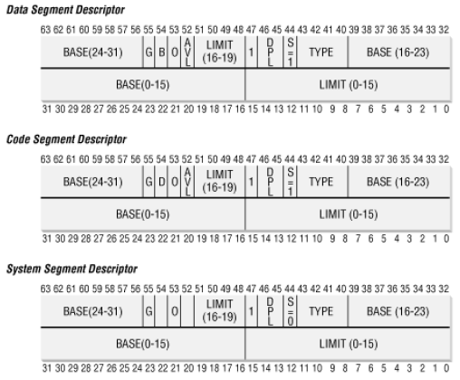
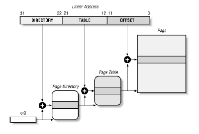
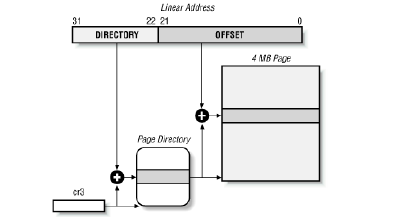
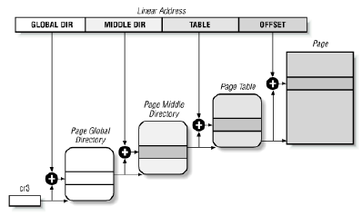
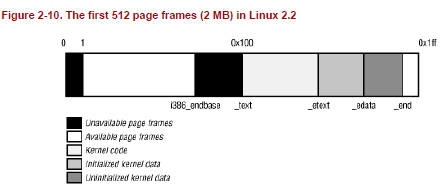

### 内存管理
>
* 逻辑地址
* 线性地址(虚拟地址)
* 物理地址
>

段描述符
>
* Base 包含段的手直接的线性地址
* G    粒度标志，0 段大小以字节为单位，否则以4096字节的倍数计
* Limit存放段中最后一个内存单元的偏移量，G=0,1字节到1MB，否则4KB到4GB
* S    系统表示，0，系统段，存储LDT这种关键的数据结构，否则为普通代码段或数据段
* Type 描述段的类型特征和它的存取权限
* DPL  描述符特权级，限制对这个段的存取，表示访问这个段要求的CPU最小的优先级，3都可以
* P    Segment-Present标志，0表示 段不在主存中，始终为1
* D或B 取决于是代码段还是数据段。
* AVL  可以由操作系统使用，但被Linux忽略 

>

分页
>
* 正在使用的页目录的物理地址存放在控制寄存器cr3中
* 页目录和页表项
  - present 1 所指的页在主存中，0不在主存，线性地址放在cr2中并产生14号缺页异常
  - 包含页框物理地址最高20位的字段
  - Accessed标志
  - dirty 只用于页表项中，对一个页表框进行写操作时就设置这个标志
  - Read/Write
  - User/Supervisor标志 0,只有CPL小于3时才能对页寻址，1 总能对页寻址
  - PCD和PWT标志
  - Page Size 只应用于页目录项 1页目录项字段是2MB或4MB的页框
>




物理地址扩展(PAE)分页机制
>
* 处理器所支持的RAM容量受连接到地址总线上的地址管脚数限制
>

Linux中的分页
>
* 页全局目录
* 页上级目录
* 页中间目录
* 页表

>

线性地址字段
>
* PAGE_SHIFT 指定Offset字段的位数
* PAGE_MASK 产生的值为0xfffff000，屏蔽Offset字段的所有位
* PMD_SHIFT 指定线性地址Offset字段和table字段的总位数
* PMD_SIZE 计算由页中间目录的一个单独表项所映射的区域大小的对数
* PMD_MASK 用于屏蔽Offset字段与Table字段的所有位
* PUD_SHIFT 确定上级目录能映射的区域大小的对象
* PUD_SIZE 计算页全局目录中的一个单独表项所能映射的区域大小
* PUD_MASK 屏蔽Offset、Table、Middle Air和Upper Air的所有位
* PGDIR_SHIFT 确定全局目录项能映射的区域大小的对数
* PGDIR_SIZE 计算页全局目录中一个单独表项能映射区域的大小
* PGDIR_MASK 评Offset、Table、Middle Air、Upper Air字段
* PTRS_PER_PTE,PTRS_PER_PMD,PTRS_PER_PUD,PTRS_PER_PGD用于计算页表，页中间目录，页上级目录，页全局目录中表项的个数
>

物理内存布局
>
* 保留，不能被动态分配或交换到磁盘
 - 在不可用的物理地址范围内的页框
 - 含有内核代码和已初始化的数据结构的页框
* 一般而言，Linux内核安装在RAM中从物理地址0x00100000开始的地方（1M 开始)
* 页框0由BIOS使用，存放加电自检期间检查到的系统硬件配置
* 物理地址0x000a0000到0x000fffff的范围通常留给BIOS例程，并且映射ISA图形卡上的内部内存
* 内核执行machine_specfic_memory_setup()函数，建立物理地址映射
* setup_memory()函数 分析物理内存区域并初始化一些变量来描述内核的物理内存布局
  - num_physpages 最高的可用页框的页框号
  - totalram_pages 可用页框的总数量
  - min_low_pfn RAM中在内核映像后第一个可用页框的页框号
  - max_pfn 最后一个可用页框的页框号
  - max_low_pfn 被内核直接映射的最后一个页框的页框号(低地址内存)
  - totalhigh_pages 内核非直接映射的页框的总数(高地址内存)
  - highstart_pfn 内核非直接映射的第一个页框的页框号
  - highend_pfn 内核非直接映射的最后一个页框的页框号
* Linux用PC体系结构未保留的页框来动态存放所分配的页

>

进程页表
>
* 从0x00000000到0xbfffffff的线性地址，无论进程运行在用户态还是内核态都可以寻址
* 从0xc0000000到0xffffffff的线性地址，只有内核态的进程才能寻址

```c
address = 0;
pg_dir = swapper_pg_dir;
pgd_val(pg_dir[0]) = 0;
pg_dir += (PAGE_OFFSET >> PGDIR_SHIFT);
while (address < end_mem) {
pgd_val(*pg_dir) = _PAGE_PRESENT+_PAGE_RW+_PAGE_ACCESSED
+_PAGE_DIRTY +_PAGE_4M+__pa(address);
pg_dir++;
address += 0x400000;
}
```
>