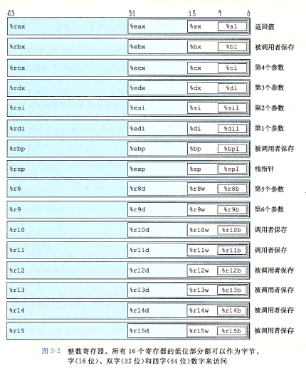
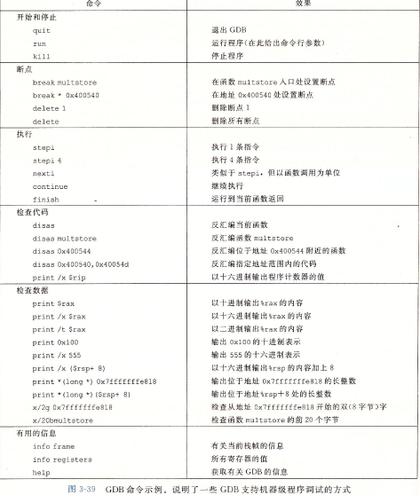
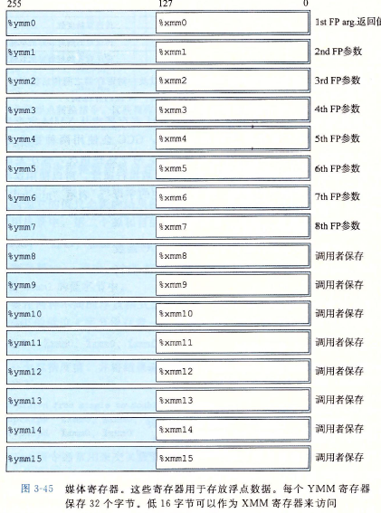
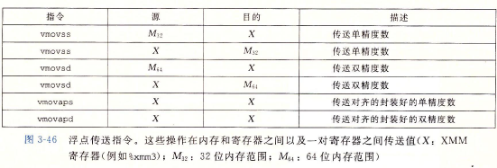
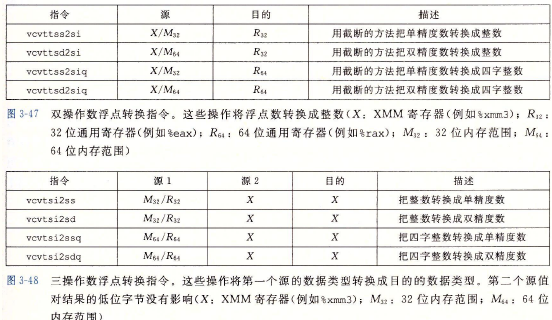

### 常见命令
```sh
# 根据机器代码产生一种类似于汇编代码的格式
linux/window> objdump -d hello.o
# GDB 调试工具
(gdb) x/14xb hello

# c语言编译器产生的汇编代码，生成hello.s文件
>gcc -Og -S hello.c

# 产生目标文件hello.o
>gcc -Og -c hello.c

# GCC产生Intel格式的代码
>gcc -Og -S -masm=intel hello.c
```
### 基本概念
* `pushl` - push long数据类型
* 以 `.`开头的都是知道汇编器和链接器工作的伪指令，通常可以忽略掉
* `pushq` - `q`是大小指示符  
  `movb` (传送字节) `movw` (传送字)
* 使用`asm`伪指令可以在C程序中包含剪短的汇编代码
* Intel用术语"字(word)"表示16位数据类型，因此，32位数为双字(double words),64位为“四字(quad words)”

### 数据格式
|C声明|Intel数据类型|汇编代码后缀|大小(字节)
|-----|------------|-----------|---------
|char|字节|b|1
|short|字|w|2
|int|双字|l|4
|long|四字|q|8
|char *|四字|q|8
|float|单精度|s|4
|double|双精度|l|8

### 访问信息
* 通用目的寄存器 - 16个存储64位值，存储整数数据和指针 `%r` - 开头

* 字节级操作可以访问最低的字节，16位操作可以访问最低的2个字节，32位操作可以访问最低的4个字节，64位操作可以访问整个寄存器
* `%esp`栈指针，用来指明运行时栈的结束位置
* `$-16` - 立即数，用来表示数值


### 条件码
|条件码|作用|
|-----|----
|CF(carry flag)|进位标志，最近的操作使最高位产生进位，可用来检查无符号操作的溢出
|ZF(zero flag)| 零标志，最近的操作得出的结果为0
|SF(sign flag)| 最近的操作得到的结果为0
|OF(overflow flag)| 溢出标志，最近的操作导致一个补码溢出-正溢出或负溢出

* `set` set指令的目的操作数是低位单字节寄存器元素之一，或是一个直接的内存位置

### 跳转
*jmp*
* 跳转是相对于跳转指令后面的那条指令的地址来进行相对寻址的。
* 目标地址 - 基准地址
* `rep ret` 中rep后跟ret的组合来避免使ret的指令称为条件跳转指令的目标

### 结构
```c
/*这个结构总共需要24字节，type为4字节，填充4字节，info。internal为16字节。*/
typedef enum {N_LEAF, N_INTERNAL} nodetype_t;

struct node_t {
    nodetype_t type;
    union {
        struct {
            struct node_t *left;
            struct node_t *right;
        } internal;
        double data[2];
    } info;
}
```
`&` 表示当前的地址

### 栈上的局部存储
* 寄存器不足够存放所有的本地数据
* 对一个局部变量使用地址运算符'&',因此必须能为它产生一个地址
* 某些局部变量是数组或结构，因此必须能够通过数组或结构引用被访问到。

### 对齐

对齐原则：任何K字节的基本对象的地址必须是K的倍数,汇编代码中的`align 8`或者`align 4`指明全局数据所需对齐。

|K|类型
|-|---
|1|char
|2|short
|4|int.float
|8|long,double,char*
即只要保证各个位置的偏移量为该位置数据类型的K的倍数就行

### 理解指针
* 每个指针都对应一个类型 - 表明该指针指向的是哪一类对象  
  char \*\*p  
  指向一个指向char类型对象的指针  
  void * 类型代表通用指针，比如：  
  malloc函数返回一个通用指针，然后通过显式强制类型转换或者赋值操作那样的隐私强制类型装换，将他装换成衣蛾有类型的指针。

* 每个指针都有一个值,`NULL(0)`值表示该指针没有指向任何地方。
* 指针用 `&` 运算符创建，可以应用到任何lvalue类的C表达式上。`leaq`
* `*` 操作符用于间接引用指针，间接引用是用内存引用来实现的，要么存储到一个指定的地址，要么从指定的地址读取
* 数组与指针紧密联系，数组引用和指针运算都需要用对象大小对偏移量进行伸缩。p+i =`p+L·i`
* 将指针从一种类型强制转换成另一种类型，只改变它的类型，而不改变它的值，效果是改变指针运算的伸缩。强制类型装换优先级高于加法
```c
char * p;
(int *)p+7  //计算为p+28
(int *)(p+c) //计算为p+7
```
* 指针也可以指向函数

### GDB 
* 命令
```sh
gdb program
```


* 内存越界引用和缓存区溢出 - c对于数组不进行任何边界检查，而且局部变量和状态信息都存放在栈中  
**缓存区溢出**

### 对齐
例题：240/204-3.49

### 浮点代码
* 浮点寄存器

* 引用内存的指令是标量指令，意味着它们只对单个而不是一组封装好的数据进行操作。数据要么存储在内存中(M32,M64),要么存储在XMM寄存器中(X).
* 优化规则建议32位内存数据满足4字节对齐，64位数据满足8字节对齐。

* 当用于读写内存时，如果地址不满足16字节对齐，会异常，'aligned(对齐)'
* 从浮点向整数转换，指令会执行截断，把值向0舍入

* 单精度装双精度  
  `vunpcklps %xmm0,%xmm0,%xmm0`  
  `vcvtps2pd %xmm0,%xmm0` 
* 双精度转单精度  
  `vmovddup %xmm0,%xmm0`  
  `vcvtpd2psx %xmm0,xmm0` 

### 过程中的浮点代码
* XMM寄存器%xmm0~%xmm7最多可以传递8个浮点参数
* 函数使用寄存器%xmm0来返回浮点数
* 所有的XMM寄存器都是调用者保存的
* 浮点运算操作 - 第一个源操作数S<sub>1</sub>可以是一个内存位置， 
  第二个源操作数和目的操作数都必须是XMM寄存器。  
  每个操作都有一条针对单精度的指令和一条针对双精度的指令，结果放在目的寄存器中。

* AVX 浮点操作不能以立即数值作为操作数，相反，编译器必须为所有的常量值分配和初始化存储空间。然后代码再把这些值从内存读入。
* 在浮点代码中使用位级操作,类似整数  

|单精度|双精度|效果|精述
|------|-----|----|---
|vxorps|vorpd|D<-S<sub>1</sub>^S<sub>2</sub>|位级异或
|vandps|andpd|D<-S<sub>1</sub>&S<sub>2</sub>|位级与(ADD)

* 浮点数比较
|指令|基于|描述|
|----|----|----
|ucomiss S<sub>1</sub>,S<sub>2</sub>|S<sub>2</sub>-S<sub>1</sub>|比较单精度值
|ucomisd S<sub>1</sub>,S<sub>2</sub>|S<sub>2</sub>-S<sub>1</sub>|比较双精度值