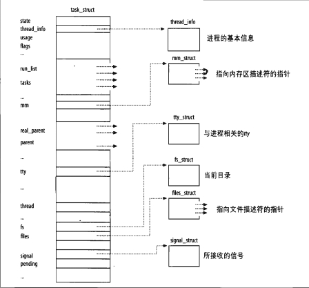
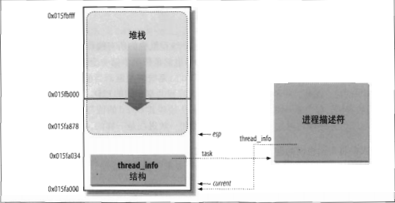
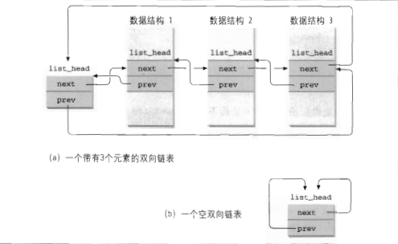
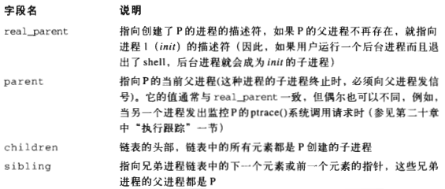
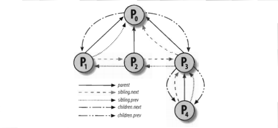

### 进程管理


```c
struct task_struct {
	volatile long state;  //说明了该进程是否可以执行,还是可中断等信息
	unsigned long flags;  //Flage 是进程号,在调用fork()时给出
	int sigpending;    //进程上是否有待处理的信号
	mm_segment_t addr_limit; //进程地址空间,区分内核进程与普通进程在内存存放的位置不同
							 //0-0xBFFFFFFF for user-thead
							 //0-0xFFFFFFFF for kernel-thread
							 //调度标志,表示该进程是否需要重新调度,若非0,则当从内核态返回到用户态,会发生调度
	volatile long need_resched;
	int lock_depth;  //锁深度
	long nice;       //进程的基本时间片
					 //进程的调度策略,有三种,实时进程:SCHED_FIFO,SCHED_RR, 分时进程:SCHED_OTHER
	unsigned long policy;
	struct mm_struct *mm; //进程内存管理信息
	int processor;
	//若进程不在任何CPU上运行, cpus_runnable 的值是0，否则是1 这个值在运行队列被锁时更新
	unsigned long cpus_runnable, cpus_allowed;
	struct list_head run_list; //指向运行队列的指针
	unsigned long sleep_time;  //进程的睡眠时间
							   //用于将系统中所有的进程连成一个双向循环链表, 其根是init_task
	struct task_struct *next_task, *prev_task;
	struct mm_struct *active_mm;
	struct list_head local_pages;       //指向本地页面     
	unsigned int allocation_order, nr_local_pages;
	struct linux_binfmt *binfmt;  //进程所运行的可执行文件的格式
	int exit_code, exit_signal;
	int pdeath_signal;     //父进程终止是向子进程发送的信号
	unsigned long personality;
	//Linux可以运行由其他UNIX操作系统生成的符合iBCS2标准的程序
	int did_exec : 1;
	pid_t pid;    //进程标识符,用来代表一个进程
	pid_t pgrp;   //进程组标识,表示进程所属的进程组
	pid_t tty_old_pgrp;  //进程控制终端所在的组标识
	pid_t session;  //进程的会话标识
	pid_t tgid;
	int leader;     //表示进程是否为会话主管
	struct task_struct *p_opptr, *p_pptr, *p_cptr, *p_ysptr, *p_osptr;
	struct list_head thread_group;   //线程链表
	struct task_struct *pidhash_next; //用于将进程链入HASH表
	struct task_struct **pidhash_pprev;
	wait_queue_head_t wait_chldexit;  //供wait4()使用
	struct completion *vfork_done;  //供vfork() 使用
	unsigned long rt_priority; //实时优先级，用它计算实时进程调度时的weight值

  //it_real_value，it_real_incr用于REAL定时器，单位为jiffies, 系统根据it_real_value
  //设置定时器的第一个终止时间. 在定时器到期时，向进程发送SIGALRM信号，同时根据
  //it_real_incr重置终止时间，it_prof_value，it_prof_incr用于Profile定时器，单位为jiffies。
  //当进程运行时，不管在何种状态下，每个tick都使it_prof_value值减一，当减到0时，向进程发送
  //信号SIGPROF，并根据it_prof_incr重置时间.
  //it_virt_value，it_virt_value用于Virtual定时器，单位为jiffies。当进程运行时，不管在何种
  //状态下，每个tick都使it_virt_value值减一当减到0时，向进程发送信号SIGVTALRM，根据
  //it_virt_incr重置初值。
  
	unsigned long it_real_value, it_prof_value, it_virt_value;
	unsigned long it_real_incr, it_prof_incr, it_virt_value;
	struct timer_list real_timer;   //指向实时定时器的指针
	struct tms times;      //记录进程消耗的时间
	unsigned long start_time;  //进程创建的时间
							   //记录进程在每个CPU上所消耗的用户态时间和核心态时间
	long per_cpu_utime[NR_CPUS], per_cpu_stime[NR_CPUS];
	//内存缺页和交换信息:
	//min_flt, maj_flt累计进程的次缺页数（Copy on Write页和匿名页）和主缺页数（从映射文件或交换
	//设备读入的页面数）； nswap记录进程累计换出的页面数，即写到交换设备上的页面数。
	//cmin_flt, cmaj_flt, cnswap记录本进程为祖先的所有子孙进程的累计次缺页数，主缺页数和换出页面数。
	//在父进程回收终止的子进程时，父进程会将子进程的这些信息累计到自己结构的这些域中
	unsigned long min_flt, maj_flt, nswap, cmin_flt, cmaj_flt, cnswap;
	int swappable : 1; //表示进程的虚拟地址空间是否允许换出
					   //进程认证信息
					   //uid,gid为运行该进程的用户的用户标识符和组标识符，通常是进程创建者的uid，gid
					   //euid，egid为有效uid,gid
					   //fsuid，fsgid为文件系统uid,gid，这两个ID号通常与有效uid,gid相等，在检查对于文件
					   //系统的访问权限时使用他们。
					   //suid，sgid为备份uid,gid
	uid_t uid, euid, suid, fsuid;
	gid_t gid, egid, sgid, fsgid;
	int ngroups; //记录进程在多少个用户组中
	gid_t groups[NGROUPS]; //记录进程所在的组
						   //进程的权能，分别是有效位集合，继承位集合，允许位集合
	kernel_cap_t cap_effective, cap_inheritable, cap_permitted;
	int keep_capabilities : 1;
	struct user_struct *user;
	struct rlimit rlim[RLIM_NLIMITS];  //与进程相关的资源限制信息
	unsigned short used_math;   //是否使用FPU
	char comm[16];   //进程正在运行的可执行文件名
					 //文件系统信息
	int link_count, total_link_count;

	//NULL if no tty 进程所在的控制终端，如果不需要控制终端，则该指针为空
	struct tty_struct *tty;
	unsigned int locks;
	//进程间通信信息
	struct sem_undo *semundo;  //进程在信号灯上的所有undo操作
	struct sem_queue *semsleeping; //当进程因为信号灯操作而挂起时，他在该队列中记录等待的操作
								   //进程的CPU状态，切换时，要保存到停止进程的task_struct中
	struct thread_struct thread;
	//文件系统信息
	struct fs_struct *fs;
	//打开文件信息
	struct files_struct *files;
	//信号处理函数
	spinlock_t sigmask_lock;
	struct signal_struct *sig; //信号处理函数
	sigset_t blocked;  //进程当前要阻塞的信号，每个信号对应一位
	struct sigpending pending;  //进程上是否有待处理的信号
	unsigned long sas_ss_sp;
	size_t sas_ss_size;
	int(*notifier)(void *priv);
	void *notifier_data;
	sigset_t *notifier_mask;
	u32 parent_exec_id;
	u32 self_exec_id;

	spinlock_t alloc_lock;
	void *journal_info;
}

```
state
>
* 可运行状态(TASK_RUNNING)
* 可中断的等待状态(TASK_INTERRUPTIBLE)
* 不可中断的等待状态(TASK_UNINTERRUPTIBLE)
* 暂停状态(TASK_STOPPED)
* 跟踪状态(TASK_TRACED)
* 僵死状态(EXIT_ZOMBIE)
* 僵死撤消状态(EXIT_DEAD)
>

>
* 32位系统最大的pid号 32767(2^15)(PID_MAX_DEFAULT-1)，64位4194303(2^22)
* tgid 线程组有该线程组的领头线程相同的PID == getpid()
* 通过task 和 pthread_info关联
* alloc_thread_info和free_thread_info分配和释放结构和内核栈的内存区
* 获取进程thread_info结构指针
```s
movl $0xffffe000,%ecx /*4k堆栈的0xfffff000*/
andl %esp,%ecx
movl %ecx,p
```
* 从thread_info获取进程地址 current_thread_info()->task 函数
因为task字段在thread_info结构中的偏移量为0
```s
movl $0xffffe000,%ecx /*4k堆栈的0xfffff000*/
andl %esp,%ecx
movl (ecx),p
```


* 双向链表
  - LIST_HEAD(list_name)创建

* 处理函数和宏

* 进程链表
  - task_struct 结构都包含一个list_head类型的tasks字段，这个类型的prev和next字段分别指向前面和后面的task_struct元素
  - 进程链表的头是init_task描述符，他是0进程(process 0)或swapper进程的进程描述符
  - init_task的task.prev字段指向链表最后插入的进程描述符的tasks字段
  - SET_LINKS和REMOVE_LINKS宏分别用于从进程中插入和删除一个进程描述符
  - for_each_process 扫描整个进程链表
  ```c
  #define for_each_process(p)
    for(p=&init_task;(p=list_entry((p)->task.next,struct task_struct,task))!=&init_task;)
  ```
  - run_list 根据优先权插入可运行进程的链表中（优先级0-139）
* prio_array_t数据结构
  - int nr_active 链表中进程描述符的数量
  - unsigned long[5] bitmap 优先权位图，当且仅当某个优先权的进程链表不为空是设置相应的标志位
  - struct list_head [140] queue 140个优先权队列的头结点
  - enqueue_task(p,array) 进程描述符prio存放进程的动态优先级
  ```c
  list_add_tail(&p->run_list,&array->queue[p->prio]);
  __set_bit(p->prio,array->bitmap);
  array->nr_active++;
  p->array=array;
  ```
  - dequeue_task(p,array)删除一个进程描述符
>

进程间的关系
>



* group_leader P所在的进程组的领头进程的描述符指针
* signal->pgrp P所在进程组的领头进程的PID
* tgid P所在线程组的领头进程的PID
* signal->session P的登录会话领头进程的PID
* ptrace_children 链表的头，该链表包含所有被debugger程序跟踪的P的子进程
* ptrace_list 指向锁跟踪进程其实际父进程链表的前一个和下一个元素(用于P被跟踪的时候)
* 4个散列表和进程描述符中的相关字段
  - Hash表的类型     字段名    说明
  - PIDTYPE_PID     pid       进程的PID
  - PIDTYPE_TGID    tgid      线程组领头进程的PID
  - PIDTYPE_PGID    pgrp      进程组领头进程的PID
  - PIDTYPE_SID     session   会话领头进程的PID
* pid结构的字段
  - int      nr       pid的数值
  - struct hlist_node  pid_chain  链接散列链表的下一个和前一个元素
  - struct  list_head 每个pid的进程链表头

>

等待队列
>
* 等待队列由双向链表实现
* 每个等待队列都有一个等待队列头，是一个类型为wait_queue_head_t的数据结构
```c
struct __wait_queue_head{
  spinlock_t lock;
  struct list_head task_list;
};
typedef struct __wait_queue_head __wait_queue_head_t;
```
* 同步是通过等待队列头中的lock自旋锁达到的
* task_list 字段是等待进程链表的头
* 等待队列链表中的元素类型为wait_queue_t
```c
struct __wait_queue
{
    unsigned int flage;//互斥进程，flags=1,非互斥进程 flags=0
    struct task_struct * tast;//描述符地址
    __wait_queue_func_t func;//等待队列中唤醒进程应该用什么方式
    struct list_head task_list;//包含指针，把一个元素 链接到等待相同事件的进程链表中
};
typedef struct __wait_queue __wait_queue_t;

```
* 两种睡眠进程 ，互斥进程，flags=1,非互斥进程 flags=0

* DECLARE_WAIT_QUEUE_HAED(name)定义一个新等待队列的头
  它静态的声明一个叫name的等待队列的头变量并对该变量的lock和task_list字段初始化
* 函数 init_waitqueue_head()可以初始化动态分配的等待队列的头变量
* 函数init_waitqueue_entry(q,p)初始化wait_queue_t结构的变量q
  ```c
  q->flags =0;
  q->task=0;
  q->func=default_wake_function;
  ```
* default_wake_function()唤醒非互斥进程p
* init_waitqueue_func_entry()函数来定义唤醒函数，负责初始化等待队列的元素
* add_wait_queue()函数把一个非互斥进程插入等待队列链表的第一个位置
* add_wait_queue_exclusive()函数把一个互斥进程插入等待队列链表的最后一个位置
* remove_wait_queue()函数从等待队列链表中删除一个进程
* waitqueue_active()函数检查一个给定的等待队列是否为空
>

TSS(task state segment) 任务状态段
>
* Linux不使用硬件上下文切换？
* 强制为系统每个不同的CPU创建一个TSS
* 从用户态切换到内核态时，就从TSS中获取内核态堆栈的地址
* 用户态试图通过in或out指令访问一个I/O端口时，CPU需要访问存放在TSS中的I/O许可权位图
  - eflags中2位的IOPL字段，如果为3，执行I/O指令，否则下一个检查
  - 访问tr寄存器以确定当前的TSS和相应的I/O许可权位图
  - 检查I/O指令指定的I/O端口在I/O许可权位图中对应的位，清0执行，否则"General protection"异常
* tss_struct结构描述TSS格式。init_tss数组为系统上每个不同的CPU存放一个TSS。进程切换内核会更新TSS的某些字段以便相应的CPU控制单元可以安全的检索到它需要的信息
* TSS反映了CPU上的当前进程的特权级，但不必为没有在运行的进程保留TSS
* TSS 8字节任务状态描述符TSSD
  32位Base字段，20位Limit字段，TSSD的S标志被清0，表示系统段
  Type字段设为11或9表示这个段是一个TSS，Type第二个有效位叫做Busy位，因为Linux每个CPU只有一个TSS，Busy位总置为1
* 由Linux创建的TSSD存放在全局描述符表(GDT)中
* GDT的基地址存放在每个CPU的gdtr寄存器中
* 每个CPU的tr寄存器包含相应TSS的TSSD选择符，及隐藏的非编程字段
  TSSD的Base字段和Limit字段
>

thread字段
>
* thread_struct 
* 进程被切换出去，内核就把其硬件上下文保存在这个结构中
* 包含字段涉及大部分CPU寄存器，但不包括eax/ebx等通用寄存器，他们的值保留在内核堆栈中
>

执行进程切换
>
* schedule()
* 切换页全局目录以安装一个新的地址空间
* 切换内核态堆栈和硬件上下文(switch_to宏)
* switch_to(prev,next,last)  
  - prev 当前 eax寄存器
  - next 下一个 
  - last 前一个
* 标准汇编语言 switch_to
```s
  movl prev,%eax
  movl next,%edx
  /*把eflags和ebp寄存器的内容保存在prev内核栈中*/
  pushfl
  pushl %ebp 
  /*把esp的内容保存到prev->thread.esp中
    484（%edx)操作数表示内存单元的地址eax+484
  */
  movl %esp,484(%eax)
  /*吧next->thread.esp装入esp
    由于进程描述符的地址和内核栈的地址紧挨着，所以改变内核栈意味着改变当前进程
   */
  movl 484(%edx),%esp
  /*把标记为1的地址存入prev->thread.eip
   当被替换的进程重新恢复执行时，进程执行被标记为1的那条指令
   */
  movl $1f,480(%eax)
  /*把next->thread.eip的值压入next的内核栈*/
  pushl 480(%edx)
  /*跳到__switch_to()函数*/
  jup__switch_to
  /*执行被进程B替换的进程A，再次获得CPU，获取eflags和ebp寄存器内容
    这两条指令的第一条指令被标记为1
   */
  popl %ebp
  popf1
  /*拷贝eax寄存器的内容到switch_to的第三个参数last*/
  movl %ebx,last
```
* __switch_to()函数 p114
```c
#include <system.h>
__switch_to(struct task_struct *prev_p,struct task_struct *next_p)
__attribute__(regparm(3));
```
  1.  __unlazy_fpu(prev_p) 执行由这个宏产生的代码，有选择的保存prev_p进程的FPU，MMX及XMM寄存器的内容
  2.  smp_processor_id()宏获得本地(local)CPU的下标，即执行代码的CPU
    &thread_info->cpu
  3.  把next_p->thread.esp0装入对应于本地CPU的TSS的esp0字段
    init_tss[cpu].esp0=next_p->thread.esp0
  4. 
>
保存和加载FPU、MMX、XMM寄存器
>
* FPU(floating-point unit) 算数浮点单元
  - 用eacape指令来执行
  - 一些前缀字节在0xd8和0xdf之间
* MMX 加速多媒体应用程序的执行
  - 引入单指令多数据流水线(single-instruction multiple data,SIMD)
  - SSE扩展(streaming SIMD extensions) 处理包含8个128位寄存器(XMM寄存器)
* 硬件支持 cr0寄存器中一个TS标志组成
  - 每当执行硬件上下文切换时，设置TS标志
  - 每当TS标志被设置时执行ESCAPE.MMX.SSE或SSE2指令，控制单元就产生一个device not available 异常
* 数据结构
  ```c
  union i387_union {
    struct i387_fsave_struct fsave;
    struct i387_fxsave_struct fxsave;
    struct i387_soft_struct soft;
  }
  ```
>

内核线程
>
* 只在内核运行，只使用大于PAGE_OFFSET的线性地址空间
* kernel_thread()
 ```c
 //pregs 内核栈的地址
 do_fork(flags|CLONE_VM|CLONE_UNTRACED,0,pregs,0,NULL,NULL);
 ```
* 传递给do_fork()的参数pregs表示内核栈的地址  
  copy_thread()将从这里找到为新线程初始化CPU寄存器的值
* 保留寄存器值的目的
  - 通过copy_thread()把ebx和edx分别设置为参数fn和arg的值
  - 把eip寄存器的值设置为下面汇编语言代码段的地址
    ```s
    movl %edx,%eax
    pushl %edx
    call *%ebx
    pushl %eax
    cal do_exit
    ```
* 新的内核线程开始执行fn(arg)函数，结束后执行_exit()，并把fn()的返回值传递给它
* swapper(0) ---init()--->init(1)
* 其他内核线程
  - keventd --执行keventd_wq工作队列中的函数
  - kapmd  --处理与高级电源管理(APM)相关的事件
  - kswapd  --执行内存回收
  - pdflush --刷新"脏"缓存区中的内容到磁盘以回收内存
  - kblockd  --执行kblockd_workqueue工作队列中的函数，周期性地激活块设备驱动程序
  - ksoftirqd --运行tasklet
>

撤销进程
>
* exit()
* 强迫整个线程组死掉
  - 当进程接收一个不能处理和忽视的信号
  - 当内核正在代表进程运行时再内核态产生一个不可恢复的CPU异常时
>

进程终止
>
* exit_group()系统调用 ，终止整个线程组
  基于do_group_exit() 内核函数
* exit()系统调用
  基于do_exit() 内核函数
>

内核控制路径
>
* 系统调用代码(一种异常处理程序)
* 异常处理程代码
* 中断处理程序代码
* 内核线程代码

* 内核控制路径不属于任何进程，没有进程标识符
  如果不开启内核抢占，内核控制路径将一直执行直到完成任务自动让出cpu  
  只要进入了内核空间，便是处于以上四种内核控制路径的某一个
>

>
* 系统调用接口
  - 把进程从用户态切换到内核态
  - 具有保护机制的计算机系统，用户必须通过中断或陷阱才可以实现
  - i386体系，int ￥ Ox80 -->向量码128 软中断
内核服务例程

>

tasklet 
一种可动态注册的软中断，保证了同一时刻只能有一个CPU在运行它

优化屏障
>
* barrier()宏
* 展开为 `asm volatile("":::"memory")`
* 指令asm告诉编译程序要插入汇编语言片段
* volatile 关键字禁止编译器将asm指令与程序中的其他指令重新组合
* memory关键字强制编译器假定RAM中的所有内存单元已经被汇编语言指令修改
* 因此，编译器不能使用存放在CPU寄存器中的内存单元值来优化asm指令前的代码
>

自旋锁
>
* 自旋锁忙等期间，内核抢占还是有效的
* 每个自旋锁用spinlock_t结构表示
  - slock 1 未加锁
  - break_lock 进程正在忙等自旋锁

* smp系统 -- 对称多处理结构
>

读写自旋锁
>
* rwlock_t
* 32位，0~23 对受保护的数据结构并发的进行读操作的内核控制路径的数目(二进制补码)
* 未锁标志 24位
* 自旋锁为空，那么lock字段的值为0x01000000
* 已获得自旋锁且无读者，lock字段的值为0x00000000
* 如果一个、两个或多个进程因为读获取了自旋锁，那么lock字段的值为0x00ffffff~0x00000001
* 0x00ffffff表示有一个读者 0x00000000表示有一个写者
>
顺序锁(seqlock)
>
* 写操作较高的优先级
* seqlock_t 结构
  - spinlock_t的lock字段
  - sequence字段 顺序计算器 初始0，未锁 奇数已锁，偶数未锁
*  spinlock_t=SEQLOCK_UNLOCKED 或 执行 seqlock_init宏，初始化为"未上锁"
* write_seqlock()和write_sequnlock()获取和释放顺序锁
* 临界区代码  
  seq奇数或seq的值与顺序锁的顺序计算器的当前值不匹配，read_seqretry()返回1
```c
unsigned int seq;
do{
  seq=read_seqbegin(&seqlock);
  /"...临界区代码..."/
}while(read_seqretry(&seqlock,seq));
```
>

RCU(读-拷贝-更新)
>
* RCU只保护被动态分配并通过指针引用的数据结构
* 在被RCU保护的临界区中，任何内核控制路径都不能睡眠

* 写者 创建副本-->更改指针--->实现写
* rcu_read_unlock()
  - CPU执行进程切换
  - CPU开始在用户态执行
  - CPU执行空循环
* 旧副本不被使用的时候释放 call_rcu(rcu_head)
>

信号量
>
* 两种信号量
  - 内核信号量，由内核控制路径使用
  - System V IPC信号量，由用户态进程使用
* 只用可以睡眠的函数才能获取内核信号量
* struct semaphore类型的对象
  - count >0 资源空闲 =0 忙但没进程等待 <0 忙至少有一个进程等待资源
  - wait 存放等待队列链表的地址
  - sleepers 标志，是否有一些进程在信号量上睡眠
* 初始化
  - init_MUTEX() DECLARE_MUTEX   count = 1
  - init_MUTEX_LOCKED() DECLARE_MUTEX_LOCKED count =0
  - DECLARE_MUTEX 和 DECLARE_MUTEX_LOCKED也静态分配semaphore结构的变量
* js(jump if sign)如果结果为负就跳转
* lea(Load effect address) 取有效地址
* 释放信号量up()
* 获取信号量 down()
>