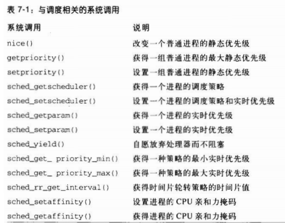
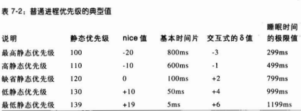
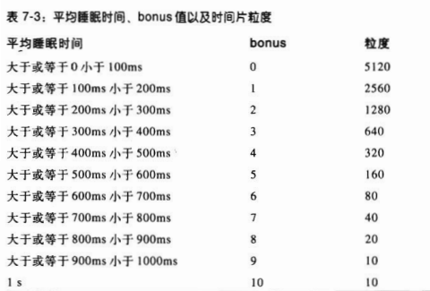
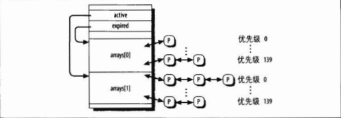

分类
>
* 交互式进程
* 批处理进程
* 实时进程
>

与调度相关的系统调用


时间片
>
* 从进程开始运行直到被抢占的时间
* 基本时间片(ms)={ (140-静态优先级)x20 静态优先级<120
                { (140-静态优先级)x5  静态优先级>=120
>
调度类型
>
* SHCED_FIFO 先进先出的实时进程
* SCHED_RR 时间片轮转的实时进程
* SCHED_NORMAL 普通的分时进程
*  
>

动态优先级
>
* 范围100~139
* 动态优先级 = max(100,min(静态优先级-bonus+5,139))
* bouns 范围从0~10
* 

* 交互式进程  
  动态优先级<=3x静态优先级/4+28  
  bonus-5>=静态优先级/4-28  
  静态优先级/4-28 称为交互式δ
>

数据结构runqueue

|类型|名称|说明
|---|----|---
|spinlock_t|lock|保护进程链表的自旋锁
|unsigned long|nr_running|运行队列链表中可运行进程的数量
|unsigned long|cpu_load|基于运行队列中进程的平均数量的CPU负载因子
|unsigned long|nr_switches|CPU执行进程切换的次数
|unsigned long|nr_uninterruptible|先前在运行队列链表中而现在睡眠在TASK_UNINTERRUPTIBLE状态的进程的数量(对所有运行队列来说，只有这些字段的总数才是有意义的)
|unsigned long|expired_timestamp|过期队列中最老的进程被插入队列的时间
|unsigned long long|timestamp_last_tick|最近一次定时器中断的时间戳的值
|task_t *|curr|当前正在运行进程的进程描述符指针(对本地CPU同current)
|task_t *|idle|当前CPU(this CPU)上swapper进程的进程描述符指针
|struct mm_struct *|prev_mm|在进程切换期间用来存放被替换进程的内存描述符的地址
|prio_array_t *|active|指向活动进程链表的指针
|prio_array_t *|expired|指向过期进程链表的指针
|prio_array_t [2]|arrays|活动进程和过期进程的两个集合
|int|best_expired_prio|过期进程中静态优先级最高的进程(权值最小)
|atomic_t|nr_iowait|先前在运行队列的链表中而现在正等待磁盘I/O操作结束的进程的数量
|struct sched_domain *|sd|指向当前CPU的基本调度域
|int|active_balance|如果要把一些进程从本地运行队列迁移到另外的运行队列，就设置这个标志
|int|push_cpu|未使用
|task_t *|migration_thread|迁移内核线程的进程描述符指针
|struct list_head|migration_queue|从运行队列中被删除的进程的链表
>
* this_rq()产生本地CPU运行队列的地址
* cpu_rq(n)产生索引为n的CPU的运行队列的地址
>

arrays
>
* 每个prio_array_t 包括140个双向链表头(每个链表对应一个可能的进程优先级)、一个优先级位图和一个集合中所包含的进程数量的计数器


>

进程描述符  

**每个进程描述符都包括几个与调度相关的字段**
>
|类型|名称|说明
|---|----|---
|unsigned long|thread_info->flags|存放TIF_NEED_RESCHED标志，如果必须调用调度程序，则设置该标志
|unsigned int|thread_info->cpu|可运行进程所在运行队列的CPU逻辑号
|unsigned long|state|进程的当前状态
|int|prio|进程的动态优先级
|int|static_prio|进程的静态优先级
|struct list_head|run_list|指向进程所属的运行队列链表中的下一个和前一个元素
|prio_array_t * |array|指向包含进程的运行队列的集合
|unsigned long|sleep_avg|进程的平均睡眠时间
|unsigned long long|timestamp|进程最近插入运行队列的时间，或涉及本进程的最近一次进程切换的时间
|unsigned long long|last_run|最近一次替换本进程的进程切换时间
|int|actived|进程被唤醒时所使用的条件代码
|unsigned long|policy|进程的调度类型(SCHED_NORMAL/SCHED_RR/SHCED_FIFO)
|cpumask_t|cpus_allowed|能执行进程的CPU的位掩码
|unsigned int|time_slice|在进程的时间片中还剩余的始终节拍数
|unsigned int|first_time_slice|如果进程肯定不会用完其时间片就把该标志设置为1
|unsigned long|rt_priority|进程的实时优先级
>

调度程序所使用的函数
>
|函数|描述
|----|---|
|scheduler_tick()|维持当前最新的time_slice计数器
|try_to_wake_up()|唤醒睡眠进程
|recalc_task_prio()|更新进程的动态优先级
|schedule()|选择要被执行的新进程
|load_balance()|维持多处理器系统中运行队列的平衡
>

scheduler_tick()函数
>
* 更新实时进程的时间片
```c
//scheduler_tick() 实时进程
if(current->policy==SCHED_RR && !--current->time_slice){
	current->time_slice=task_timeslice(current);
	current->first_time_slice=0;
	set_tsk_need_resched(current);
	list_del(&current->run_list);
	list_add_tail(&current->run_list,
		this_rq()->active->queue+current->prio);
}
```
* 更新普通进程的时间片
>


try_to_wake_up()函数
>
* 通过把进程状态设置为TASK_RUNNING,并把该进程插入本地CPU的运行队列来唤醒睡眠或停止的进程
>