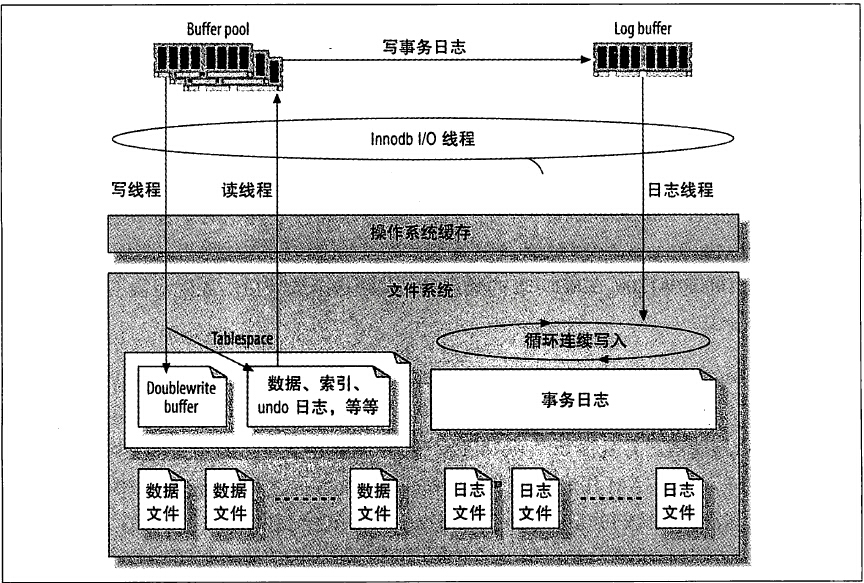
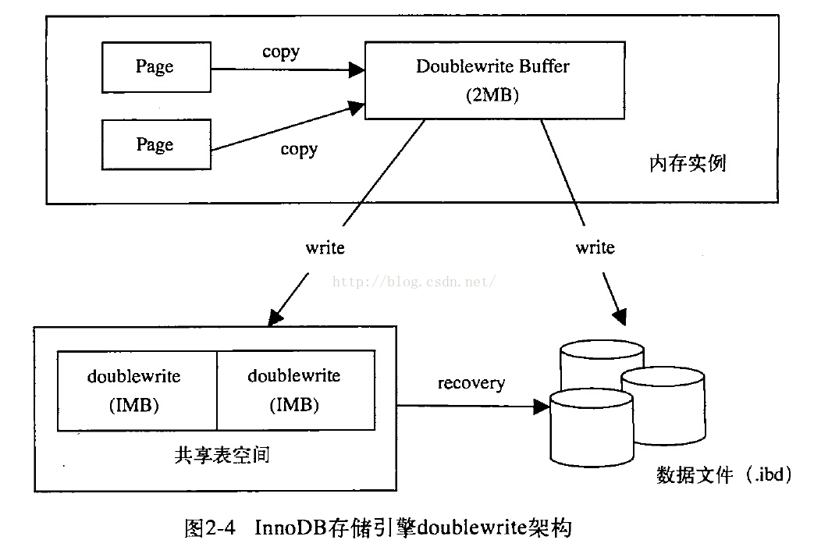

## mysql

### innodb




* 缓存池(buffer pool)
  - 事务提交后，innodb首先在缓存池中找到对应的页，把事务更新到缓存区中
  - 缓存区把脏页拷贝到double write buffer，double write buffer 把脏页刷新到double write 磁盘(顺序IO)，再把脏页刷新到数据文件

* 日志缓存(log buffer)
  - 减少事务提交时的开销，因为日志记录了事务，就无须在每个事务提交时把缓存池中的脏块刷新到磁盘
  - innodb 的日志缓冲有两个重要的参数
    - innodb_log_buffer_size 日志缓冲区大小
    - innodb_flush_log_at_trx_commit innodb刷新事务日志的策略参数，，默认1
       - 0 一秒钟刷新一次，，事务提交时，不做任何操作
       - 1 每次提交都刷新到持久化存储(默认&安全)
       - 2 每次提交都把日志缓冲写到日志文件，但并不刷新(系统级日志)

* 事务日志
 - innodb_log_file_size mysql 5.6 默认50M
 - innodb_log_files_in_group mysql5.6 默认2
 - Linux通过 /etc/my.cnf 修改事务日志文件的大小，win 是my.ini配置文件
 - innodb是环形方式写入

* 双写缓冲 innodb_doublewrite 来关闭


  - innodb提交事务过程
    1. 把事务写入日志缓冲(log buffer),日志缓冲把事务刷新到事务日志
    2. 把事务写入缓存池(buffer pool)
  - innodb存储引擎在事务提交后，是把随机IO转化为顺序IO来达到快速提交事务的目的
  - 每次刷新脏页到磁盘，实际上是2次写页到磁盘
    1. 刷新脏页到双写缓冲，顺序IO
    2. 调用一次fsync()刷新到磁盘，随机IO
  - 宕机或者意外奔溃重启mysql时，根据事务日志来做日志恢复缓冲池未来得及刷新到磁盘的脏页，保证数据完整性

* 正在执行事务的[事务](https://dev.mysql.com/doc/refman/5.5/en/innodb-trx-table.html)
  
  - SELECT * FROM INFORMATION_SCHEMA.INNODB_TRX;
  - TRX_ID 
  - TRX_WEIGHT 事务的权重，更改的行数或者事务锁定的行数
  - TRX_STATE 事务执行的状态。running，lock wait,rolling back,committing
  - TRX_STARTED 执行开始时间
  - TRX_REQUESTED_LOCK_ID 事务当前正在等待的锁的ID
  - TRX_WAIT_STARTED 开始等待锁定的时间
  - TRX_MYSQL_THREAD_ID Mysql线程id
  - TRX_QUERY 事务正在执行的SQL语句


### 关系型和非关系型区别
   * 关系型 索引B+Tree
   * 分布式存储的问题 - CAP理论
     - 一个分布式系统不能同时满足一致性(C:Consistency),可用性(A:Availability),分区容错性(P:Partitiontolerace) 这三个基本需求
     最多可满足其中两个

     

   * BASE 理论 - 权衡一致性和可用性
      - BA(Basically Available) 基本可用
      - S(Soft State) 软状态
      - E(Eventually Consistent) 最终一致性
   * 分布式存储算法
      - Paxos算法 一致性算法
      - 分区
      - 分片 读写分离等
      - 一致性哈希(Consistent Hashing)
   * NoSQL的优点/缺点
      - 易扩展 、高性能、数据类型灵活 、高可用
      - 没有标准、没有存储过程、不支持SQL、功能不过完善
### innodb和myisam区别

  * MyISAM 索引文件和数据文件分离，分别为MYD、MYI，innodb不分离，都在ibd中
  * MyISAM 引擎中，叶子节点存储的数据是索引和数据的文件指针两类
  * innodb 索引结构是在同一个树节点中同时存放索引和数据
  * innodb 聚集索引中叶节点包含了完整的数据记录
  * innodb必须有主键，并且推荐使用整型自增主键
### explain 字段含义
id | select_type | table | partitions | type | possible_keys | key | key_len | ref | rows | filtered | Extra


### 快速插入
* 取消安全更新限制  SET SQL_SAFE_UPDATES = 0;
* 取消自动commit `set autocommit=0`
* 取消索引 

```sql
CREATE DEFINER=`root`@`localhost` PROCEDURE `vehicle_diagnosis_insert`()
delimiter ;;
BEGIN
DECLARE i INT DEFAULT 1;#不能是0
start transaction; #加快
WHILE i<1000000000
DO
  insert into `patac`.zvehicle_diagnosis(vin,outline_id,start_time,end_time,type,total_time,total_mile,end_mileage) values(CONCAT("LSG",FLOOR(RAND() * 100000000)),FLOOR(RAND() * 10000000000),DATE_ADD('2016-01-01 00:00:00',  INTERVAL  FLOOR(1 + (RAND() * 111985303)) SECOND ),DATE_ADD('2016-02-01 00:00:00',  INTERVAL  FLOOR(1 + (RAND() * 111985303)) SECOND),"车辆",0,FLOOR(RAND() * 100000000),FLOOR(RAND() * 1000000000));
  set i=i+1;
END WHILE;
commit;
END ;;
delimiter ;
```

### 系统命令
```sql

#查看数据表信息
#TABLE_SCHEMA : 数据库名
#TABLE_NAME：表名
#ENGINE：所使用的存储引擎
#TABLES_ROWS：记录数
#DATA_LENGTH：数据大小
#INDEX_LENGTH：索引大小
SELECT * FROM information_schema.TABLES  where TABLE_NAME='zvehicle_diagnosis';

show status like '%max_connections%' #最大连接数
show status like 'Threads%';  #线程
```

### 导入导出功能
* 导入
```sh
mysql> source path/filename.sql
```
* 导出
```sh
>mysqldump -u[username] -p[password] [database] --add-drop-table >e:\new\myshop.sql
```

### 增删改查
### 表操作
### 数据库设计

### 查看表的注释和创建  
    注意键反引号

```sh
#创建
>create table `users`(
	`id` int(11) auto_increment primary key comment '学号',
	`name` varchar(32) not null default '' comment '姓名'
 )engine = innodb charset = utf8 comment = '表注释';

# 查看创建表的命令
>show create table `users`;

#修改表注释
>alter table `users` comment '注释';

#修改字段的注释
>alter table `users` modify column `id` comment '号码';

#查看表结构包括注释
>show full columns from `users`;
```
### 便捷方法

```sql
select @@IDENTITY id ## insert into 后获得自动插入的id, @@IDENTITY返回为当前会话的所有作用域中的任何表最后生成的标识符
select SCOPE_IDENTITY() as id ## 返回当前作用域和当前会话的任何表最后生成的标识符

```
### 函数

* CONCAT() - 将多个字符串连接成一个字符串  
* CONCAT_WS(separator,str1,str2,…) - 用separator分割参数
* CAST(value as type); - 获取一个类型的值并产生另一个类型的值
   * 二进制，同带binary前缀的效果 : BINARY    
   * 字符型，可带参数 : CHAR()     
   * 日期 : DATE     
   * 时间: TIME     
   * 日期时间型 : DATETIME     
   * 浮点数 : DECIMAL      
   * 整数 : SIGNED     
   * 无符号整数 : UNSIGNED
* CONVERT(value, type); - 获取一个类型的值并产生另一个类型的值

### 条件优先级
从左到右
and > or

### log
MySQL有以下几种日志：
* 错误日志： -log-err
* 查询日志： -log
* 慢查询日志: -log-slow-queries
* 更新日志: -log-update
* 二进制日志： -log-bin

```sql
show variables like 'log_%'; ## 是否启用了log
show master status ##怎么知道当前的日志
show master logs ##显示二进制日志数目
```
### 连接
```sh
mysqladmin -uroot -ppassword processlist ## 所有连接详细信息
mysqladmin -uroot -ppassword status ## 连接数

mysql>show full processlist ## 所有连接进程
```

### 权限

### 时间
- datatime
  * 占用8字节
  * 允许空值，可以自定义
  * 实际格式存储
  * 与时区无关
  * 使用 now() 插入当前时间
- timestamp
  * 占用4字节
  * 允许空值，不可自定义
  * 在1970-2037之间
  * 值以UTC格式保存
  * 时区转化，存储时对当前的时区进行转化，检索时再转回当前的时区
  * 默认值为CURRENT_TIMESTAMP()
  * `field_time` timestamp NOT NULL DEFAULT CURRENT_TIMESTAMP ON UPDATE

  ### float,double,decimal
  * float 32位，精确存取6位数的浮点型数据
  * double 64位，精确存取13位数字左右的浮点型数据
  * decimal

