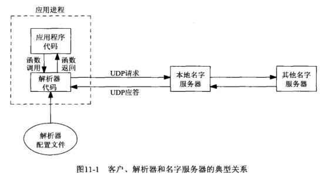
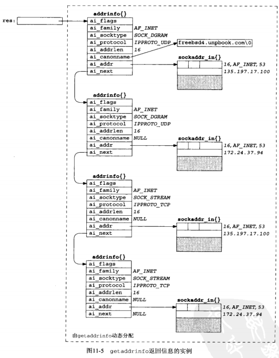
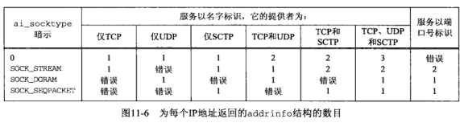
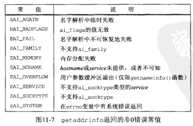
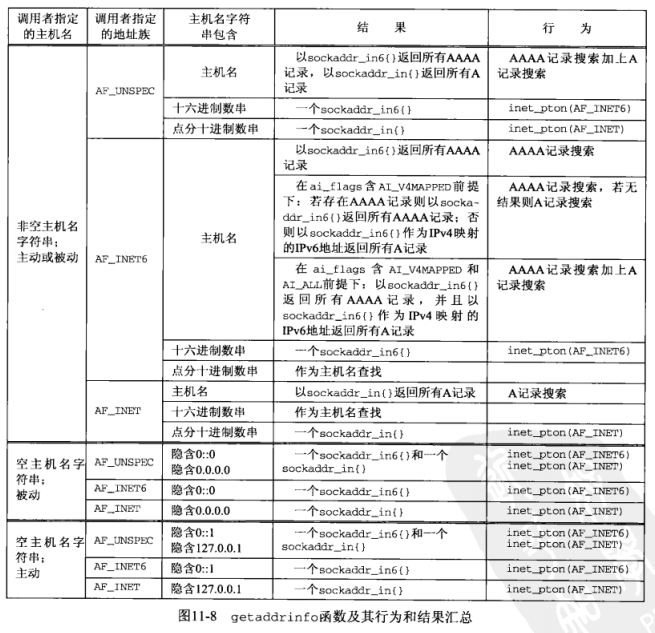
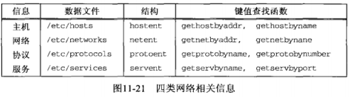

## <center>名字与地址转换</center>
* gethostbyname 主机名映射为IPv4地址
* gethostbyaddr IPv4地址映射为主机名
* getservbayname
* getservbyport
* getaddrinfo
* getnameinfo

### 域名系统
* DNS 主机名字与IP地址之间的映射
* FQDN 全限定域名 
* RR(resource record) 资源记录
  - A A记录把一个主机名映射成一个32位的IPV4地址。
  - AAAA(四A) 把一个主机名映射成一个128位的IPv6地址
  - PTR 指针记录把IP地址映射成主机名
    - 对IPv4地址，32位地址的4个字节先反转顺序，每个字节都转换成各自的十进制ASCII值，再添加上 in-addr.arpa,用于PTR查询
    - 对IPv6地址，128位地址中的32个4位组先反转顺序，每个个四位组都被转换成相应的十六进制ASCII值，再添加ip6.arpa
  - MX 把一个主机指定作为给定主机的“邮件交换器(max exchanger)”,当存在多个MX记录时，它们按照优先级顺序使用，值越小优先级越高
  - CNAME (canonical name) 规范名字，为常用服务指派CNAME记录

```
12.106.32.254   --->   254.32.106.12.in-addr.arpa
3ffe:b80:1f8d:1:a00:20ff:fea7:686b    --->
b.6.8.6.7.a.e.f.f.f.0.2.0.0.a.1.d.8.f.1.0.8.b.e.f.f.3.ip6.arpa
```

* 解析器和名字服务器
  - BIND 名字服务器
  - 应用进程、解析器和名字服务器
  - 解析器代码通过读取其系统相关配置文件确定本组织机构的名字服务器们所在位置。
  - 文件 /etc/resolv.conf通常包含本地名字服务器主机的IP地址
  - 如果答案太长，超出UDP消息的承载能力，本地名字服务器和解析器会自动切换到TCP


* DNS替代方法
  - 常用替代方法有静态主机文件(/etc/hosts)、网络信息系统(Network Information System,NIS) 以及轻权目录访问协议(Lightweight Directory Access Protocol,LDAP)

* gethostbyname 函数
  - 执行的是对A记录的查询，只返回IPv4地址
  - 发生错误时，它不设置errno值，而是将全局整数变量 h_errno 设置为在头文件 <netdb.h>中定义常值之一
  - NO_DATA 表示指定的名字有效，但是没有A记录

```c
#include <netdb.h>
#define HOST_NOT_FOUND
#define TRY_AGAIN
#define NO_RECOVERY
#define NO_DATA
struct hostent{
  char *h_name;      // official (canonical) name of host
  char **h_aliases;  //pointer to array of pointers to alias names
  int h_addrtype;    //host address type:AF_INET
  int h_length;      //length of address:4
  char **h_addr_list //ptr to array of ptrs with IPv4 addrs
};
struct hostent *gethostbyname(const char *hostname);
//返回：若成功则为非空指针，若出错则为NULL且设置h_errno
```
[hostent](../hostent.c)

* gethostbyaddr函数
  - 二进制的IP地址找到相应的主机名
  - addr实际上不是char *类型，而是一个指向存放IPv4地址的某个in_addr结构的指针，len是这个结构的大小，对于IPv4，family参数为AF_INET
  - gethostbyaddr在in_addr.arpa域中向一个名字服务器查询PTR记录 
```c
#include <netdb.h>
struct hostent *gethostbyaddr(const char *addr,socklen_t len,int family);
//返回：若成功则为非空指针，若出错则为NULL且设置h_errno
```

* getservbyname 和 getservbyport 函数
  - 从名字到端口号的映射关系保存在一个文件中(通常是 /ect/services)
  - 端口号以网络字节返回的，把它存放到套接字地址结构时绝对不能调用htons
  - grep -e ^ftp -e ^domain /etc/services
  - getservbyport用于根据端口号和可选协议查找相应服务
  - getservbyport port参数的值必须为网络字节序
  - grep 512 /etc/services

```c
#include <netdb.h>
struct servent {
  char *s_name;    //official service name
  char **s_aliases;//alias list
  int s_port;      //port number,network byte order
  char *s_proto;   //protocol to use
};

struct servent *getservbyname(const char *servname,const char *protoname);
//返回：若成功则为非空指针，若出错则为NULL
struct servent *sptr;
sptr = getservbyname("domain","udp"); //dns using udp
sptr = getservbyname("ftp","tcp");    //ftp using tcp
sptr = getservbyname("ftp",NULL);
sptr = getservbyname("ftp","udp");    //this call with fail

struct servent *getservbyport(int port,const char *protoname);
//返回：若成功则为非空指针，若出错则为NULL
sptr = getservbyport(htons(53),"udp"); //DNS using UDP
sptr = getservbyport(htons(21),"tcp"); //FTP using TCP
sptr = getservbyport(htons(21),NULL);  //FTP using TCP
sptr = getservbyport(htons(21),"udp"); //this call with fail
```

[daytimetcpcli](../daytimetcpcli.c)

* getaddrinfo 函数 
  - 通过result指针参数返回一个指向addrinfo结构链表的指针

```c
#include <netdb.h>
struct addrinfo{
  int ai_flags; //AI_PASSIVE,AI_CANONNAME
  int ai_family;//AF_xxx
  int ai_socktype; //SOCK_xxx
  int ai_protocol; //0 or IPPROTO_xxx for ipv4 and ipv6
  socklen_t ai_addrlen;//length of ai_addr
  char *ai_canonname;//ptr to canonical name for host
  struct sockaddr *ai_addr;
  struct addrinfo *ai_next;
}

int getaddrinfo(const char *hostname,const char *service,const struct addrinfo *hints,struct addrinfo **result);
//返回：若成功则为0，若出错则为非0
```





* gai_strerror函数
```c
#include <netdb.h>
const char *gai_strerror(int error);
//返回:指向错误描述符消息字符串的指针
```


* freeaddrinfo函数
```c
#include <netdb.h>
void freeaddrinfo(struct addrinfo *ai);
```

### getaddrinfo函数:IPV6



### host_serv函数
```c
#include <netdb.h>
struct addrinfo *host_serv(const char *hostname,const char *service,int family,int socktype);
//若成功，返回指向addrinfo结构的指针，若出错则为NULL


struct addrinfo *host_serv(const char *host,const char *serv,int family,int socktype)
{
  int n;
  struct addrinfo hints, *res;
  bzero(&hints,sizeof(struct addrinfo));
  hints.si_flags = AI_CONONNAME;
  hints.si_family = family;
  hints.si_socktype = socktype;
  
  if((n=getaddrinfo(host,serv,&hints,&res))!=0)
     return(NULL);
  return(res);
}
```

### UDP
[udp_server](../daytimeudpservice.c)
[udp_client](../daytimeudpclient.c)

### getnameinfo 函数
```c
#include <netdb.h>

int getnameinfo(const struct sockaddr *sockaddr,socklen_t addrlen,char *host,socklen_t hostlen,char *serv,socklen_t servlen,int flags);
//返回：若成功则为0，若出错则为非0
```

* sock_ntop和getnameinfo 差别在于
  - 前者不涉及DNS，只返回IP地址和端口号的一个可显示版本
  - 后者通常尝试获取主机和服务的名字
  


* TCP(流式套接字) UDP(数据报套接字)
* NI_NOFQDN 标志导致返回的主机名第一个点号之后的内容被截去  
  aix.udpbook.com  -> aix
* NI_NUMERICSCOPE 标志指定以数值格式作为字符串返回范围标识，以代替其名字

* 在一个普通的UNIX进程中发生重入问题的条件是：从它的主控制流中和某个信号处理函数中同时调用gethostbyname或gethostbyaddr

* 可重入：意味着它除了使用自己栈上的变量以外不依赖于任何环境(包括static)
```c
int main()
{
  struct hostent *hptr;
  ...
  signal(SIGALRM,sig_alrm);
  ...
  hptr = gethostbyname(...);
  ...
}

void sig_alrm(int signo)
{
  struct hostent *hptr;
  ...
  hptr = gethostbyname(...);
  ...
}
```

* alarm
  - `gethostbyname`,`gethostbyaddr`,`getservbyname`,`getservbyport`都是不可重入的，因为它们都返回指向同一个静态结构的指针
  - `inet_pton` 和 `inet_ntop` 总是可重入的
  - `inet_ntoa` 是不可重入的
  - `getaddrinfo` 可重入的前提是由它调用的函数都可重入,本函数的结果全部存放在动态内存空间的原因之一就是允许它可重入
  - `getnameinfo` 可重入的前提是由它调用的函数都可重入

* 在信号处理函数中不调用任何不可重入的函数，errno问题可通过把信号处理函数编写成预先保存并事后恢复errno的值加以避免

```c
void sig_alrm(int signo)
{
  int errno_save;
  errno_save = errno;
  if(write(...)!=nbytes)
    fprint(stderr,"write error，errno = %d\n",errno);
  errno=errno_save;
}
```

### gethostbyname_r 和 gethostbyaddr_r函数

```c
#include <netdb.h>
struct hostent *gethostbyname_r(const char *hostname,struct hostent *result,char *buf,int buflen,int *h_errnop);

struct hostent *gethostbyaddr_r(const char *addr,int len,int type,struct hostent *result,char *buf,int buflen,int *h_errnop);
//均返回:若成功则为非空指针，若出错则为NULL
```
* 两种方法可以把不可重入的函数改为可重入函数
  - 把由不可重入函数填写并返回静态结构的做法改为由调用者分配再由可重入函数填写结构
  - 由可重入函数调用malloc以动态分配内存空间



### 习题
7. 调用getsockname

```c
      struct sockaddr_storage ss;
      socklen_t len;
      len = sizeof(ss);
      if(getsockname(sockfd,(SA *)&ss,&len)<0)
```
8. 关闭 SO_REUSEADDR