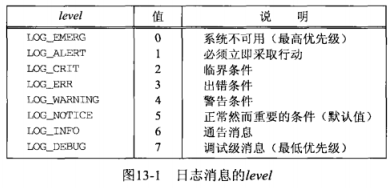
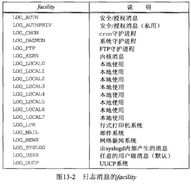
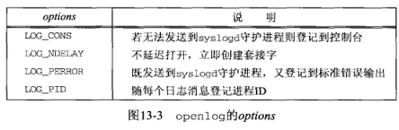

## <center>守护进程和inetd超级服务器</center>

### syslogd守护进程
>> 启动时执行以下步骤
  1. 读取配置文件。通常为/etc/syslog.conf
  2. 创建一个Unix域数据报套接字，给它捆绑路径名 /var/run/log 在某些系统上是 /dev/log
  3. 创建一个UDP套接字，给它捆绑端口514(syslog服务使用的端口号)
  4. 打开路径名 /dev/klog

### syslog 函数

* priority是级别(level)和设施(facility)两者结合
  - level
  - facility 标识消息发送进程类型的facility
  - facility和level的目的在于，允许在/etc/syslog.conf文件中统一配置来自同一给定设施的所有消息，或同一配置具有相同级别的所有消息
* message参数类似printf的格式串，不过增设了 %m规范，它被替换成与当前errno值对应的出错消息
* 当syslog被应用进程首次调用时，它创建一个Unix域数据报套接字，然后调用connect连接到由syslogd守护进程创建的Unix域数据报套接字的总所周知的路径名，这个套接字一直保持打开直到进程终止为止，也可以用openlog和closelog替换
```c
#include <syslog.h>
void syslog(int priority,const char *message,...);
```




```c
#include <syslog.h>
void openlog(const char *ident,int options,int facility);
/*
ident 是由syslog冠于每个日志消息之前的字符串，通常是程序名
options

*/
void closelog(void);
```



* openlog被调用时，通常并不立即创建Unix域套接字。该套接字直到首次调用syslog时才打开。

### daemon_init 函数
* 通过调用daemon_init能够把一个普通进程转变为守护进程
