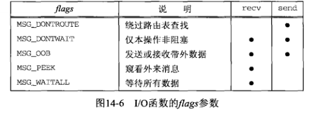
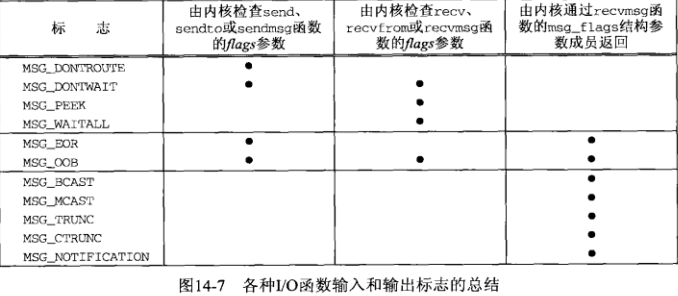
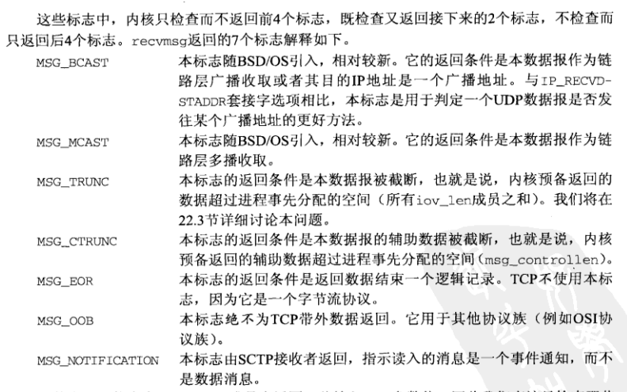
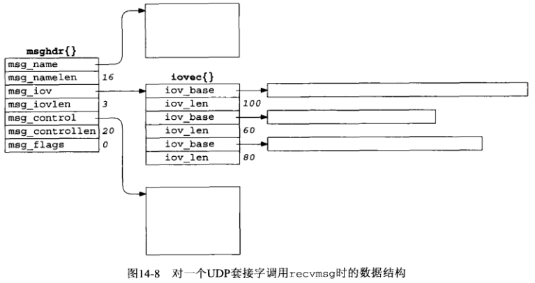
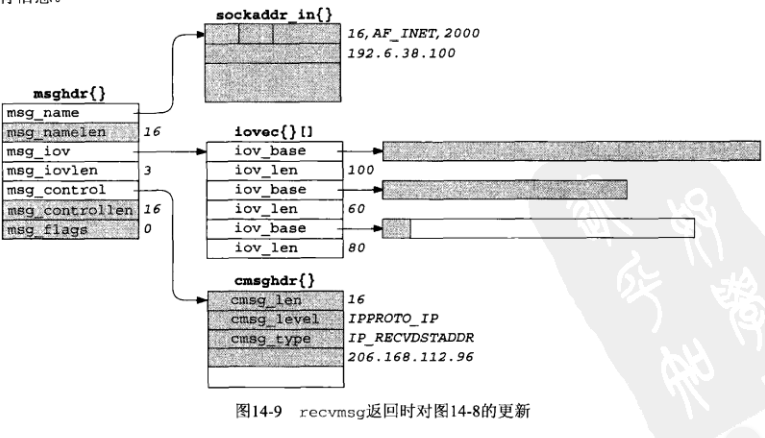
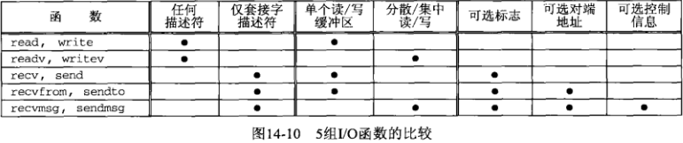
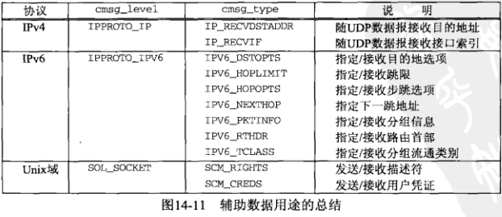
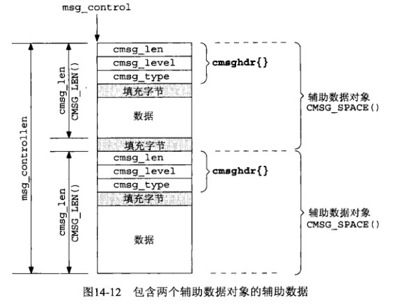

## <center>高级I/O函数</center>

### 套接字超时
* 使用SIGALRM为connect设置超时

[SIGALRM](../util.c)

```c
int connect_timeo(int sockfd,const sockaddr *saptr,socklen_t salen,int nsec)
```

* 使用SIGALRM为recvfrom设置超时

[SIGALRM](../util.c)

```c
void dg_cli(FILE *fp, int sockfd, const struct sockaddr *pservaddr, socklen_t servlen)
```

* select 为 recvfrom 设置超时

[SIGALRM](../util.c)

```c
void dg_cli_select(FILE *fp,int sockfd,const sockaddr *pservaddr,socklen_t servlen)
```

* 使用SO_RCVTIMEO套接字选项为recvfrom设置超时
  - 本选项一旦设置到某个描述符，其超时设置将应用于改描述符上的所有读操作
  - SO_SNDTIMEO 选项仅仅应用于写操作，两者都不能用于为connect设置超时
  - 如果I/O超时，其函数将返回一个 EWOULDBLOCK错误

[SIGALRM](../util.c)

```c
void db_cli_so(FILE *fp,int sockfd,const sockaddr *pservaddr,socklen_t servlen)
```

### recv 和 send 函数
```c
#include <sys/socket.h>
ssize_t recv(int sockfd,void *buff,size_t nbytes,int flags);
ssize_t send(int sockfd,const void *buff,size_t nbytes,int flags);
//返回：若成功则为读入或写出的字节数，若出错则为-1
```


* MSG_DONTROUTE 告知内核目的主机在某个直接连接的本地网络上，无需执行路由表查找，SO_DONTROUTE
* MSG_DONTWAIT 在无需打开相应套接字的非阻塞标志的前提下，把单个I/O操作临时指定为非阻塞，执行I/O操作后关闭非阻塞标志
* MSG_OOB
  - 对于send,本标志指明即将发送带外数据
  - 对于recv,本标志指明即将读入的是带外数据而不是普通数据
  - TCP连接上只有一个字节可以作为带外数据发送
* MSG_PEEK 本标志适用于recv和recvfrom,它允许我们查看已可读的数据而且系统不在recv或recvfrom返回后丢弃这些数据
* MSG_WAITALL 告知内核不要在尚未读入请求数目的字节之前让一个读操作返回

### readv 和 writev 函数
* readv 和 writev这两个函数可用于任何描述符，writev是一个原子操作
* readv 和 writev 允许单个系统调用读入到或写出自一个或多个缓冲区，这些操作分别称为分散读(scatter read)和集中写(gather write)
* iovcnt ≤ IOV_MAX
```c
#include <sys/uio.h>
struct iovec{
    void *iov_base; /*starting address of buffer*/
    size_t iov_len; /*size of buffer */
}
ssize_t readv(int filedes,const struct iovec *iov,int iovcnt);
ssize_t writev(int filedes,const struct iovec *iov,int iovcnt);
//返回：若成功则为读入或写出的字节数，若出错则为-1
```

### recvmsg和sendmsg

```c
#include <sys/socket.h>
struct msghdr{
    void *msg_name;
    socklen_t msg_namlen;
    struct iovec * msg_iov;
    int msg_iovlen;
    void *msg_control;
    socklen_t msg_controllen;
    int msg_flags;
}
ssize_t recvmsg(int sockfd,struct msghdr *msg,int flags);
ssize_t sendmsg(int sockfd,struct msghdr *msg,int flags);
//返回：若成功则为读入或写出的字节数，出错为-1
```

* recvmsg 和 sendmsg,我们必须区别它们的两个标志变量，一个是传递值的flags参数，另一个是传递msghdr结构的msg_flags成员，它传递的是引用
* 只有recvmsg使用msg_flags成员，recvmsg被调用时，flags参数被复制到msg_flags成员，并由内核使用其值驱动接收处理过程。内核还依据recvmsg的结果更新msg_flags成员的值
* sendmsg忽略msg_flags成员,因为它直接使用flags参数驱动发送处理过程










### 辅助数据
* 辅助数据由一个或多个辅助数据对象构成


```c
#include <sys/socket.h>
#include <sys/param.h>
struct cmsghdr {
    socklen_t cmsg_len;
    int cmsg_level;
    int cmsg_type;
}

struct cmsghdr *CMSG_FIRSTHDR(struct msghdr *mdhrptr);
        //返回：指向第一个cmsghdr结构的指针，若无辅助数据则为null
struct cmsghdr *CMSG_NXTHDR(struct msghdr *mhdrptr,struct cmsghdr *cmsgptr);
        //返回：指向下一个cmsghdr结构的指针，若不再有辅助数据对象则为null
unsigned char * CMSG_DATA(struct cmsghdr * cmsptr);
        //返回：指向与cmsghdr结构关联的数据的第一个字节的指针
unsigned int CMSG_LEN(unsigned int length);
        //返回：给定数据量下存放到cmsg_len中的值
unsigned int CMSG_SPACE(unsigned int length);
        //返回：给定数据量下一个辅助数据对象总的大小


struct msghdr msg;
struct cmsghdr *cmsgptr;

for(cmsgptr=CMSG_FIRSTHDR(&msg);cmsgptr!=NULL;cmsgptr=CMSG_NXTHDR(&msg,cmsgptr))
{
    if(cmsgptr->cmsg_level == ... && cmsgptr->cmsg_type == ...){
        u_char *ptr;
        ptr=CMSG_DATA(cmsgptr);
    }
}
```



### 排队的数据量

### 套接字和标准I/O
* 完全缓冲
  - 缓冲区满
  - 显示调用fflush
  - 进程调用exit终止自身
  - 大小通常为 8192字节
* 行缓冲
  - 碰到一个换行符
  - 进程调用fflush
  - 进程调用exit终止自身
* 不缓冲
  - 每次调用标准I/O都发生I/O

* 标准错误输出总是不缓冲
* 标准输出和标准输入完全缓冲，除非它们指代终端设备(行缓冲)
* 所有其他I/O流都是完全缓冲，除非它们指代终端设备(行缓冲)
```c
#include "udp.h"
void str_echo(int sockfd)
{
    char line[MAXLINE];
    FILE *fpin,*fpout;
    fpin = fdopen(sockfd,"r");
    fpout = fdopen(sockfd,"w");
    while(fgets(line,MAXLINE,fpin)!=NULL) //只有FIN才返回NULL
      fputs(line,fpout);
}
```

### 高级轮询技术

* /dev/poll 接口