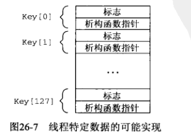
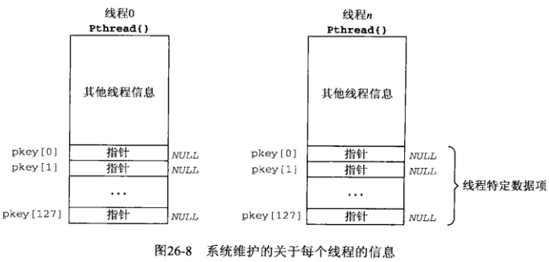

## 
非阻塞式I/O

### 非阻塞式connect 
* 当在一个非阻塞TCP套接字上调用connect时，connect将立即返回一个 EINPROGRESS错误，不过已经发起的TCP三路握手继续进行
*  使用select指定时间限制，使得我们能够缩短connect的超时
*  当连接到同一个主机上，当我们调用connect时，连接通常立即建立

### 非阻塞connect:时间获取程序

* 判断连接是否建立
  - getpeername代替getsockopt,如果以ENOTCONN错误失败返回，那么连接建立已经失败
  - 以值为0的长度参数调用read,如果read失败，那么connect已经失败
  - 再调用connect一次，它应该失败，如果错误是EISCONN，那么套接字已经连接

[code](../client.c)

* 线程安全
  - 使用线程特定数据

    
  - 改变调用顺序
  - 避免使用静态变量

