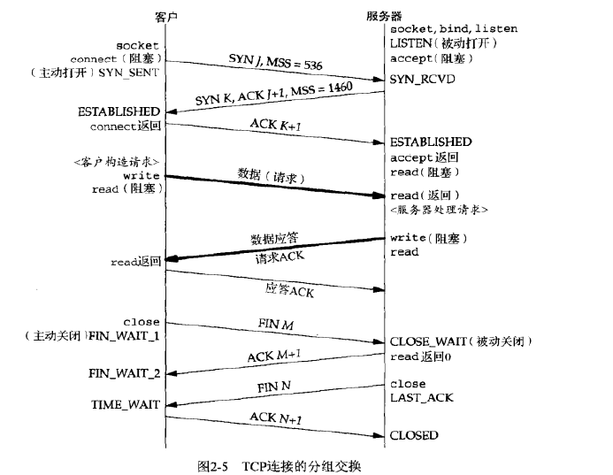

### 

* 习题2.4
给在第一章中讲解的时间获取客户/服务器应用画出类似图2-5的分组交换过程，假设服务器在单个TCP分节中返回26个字节的完整数据

* 习题2.6
  OSPF 89
* 习题2.7
  在讨论SCTP输出时我们说过，SCTP发送端必须等待累积确认点超过已发送的数据，才可以从套接字缓冲区中释放该数据。假设某个选择性确认（SACK）表明累积确认点之后的数据也得到了确认，这样的数据为什么却不能被释放呢？