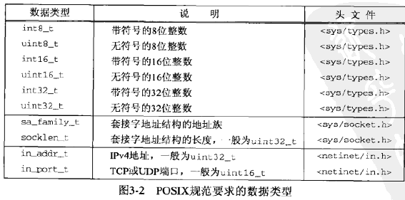
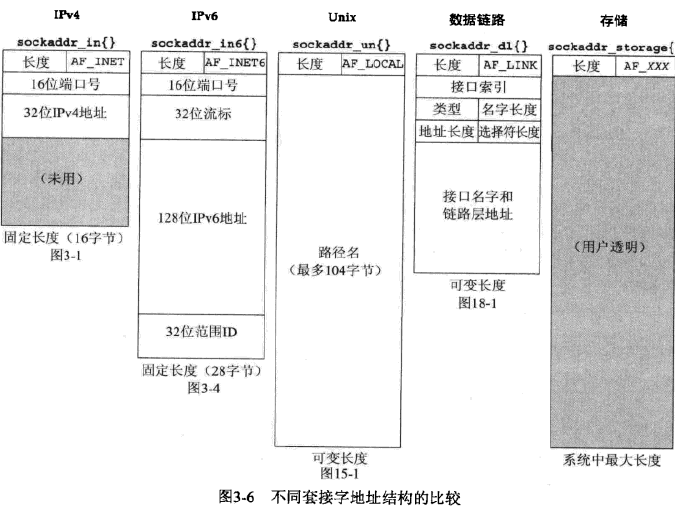
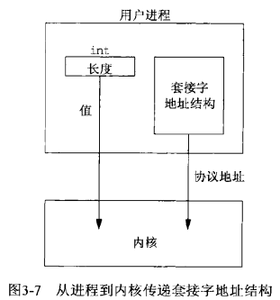
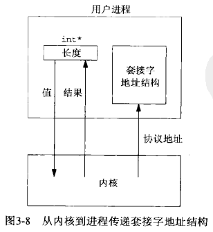
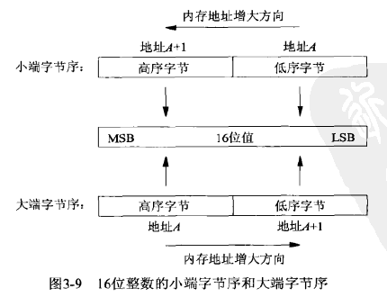
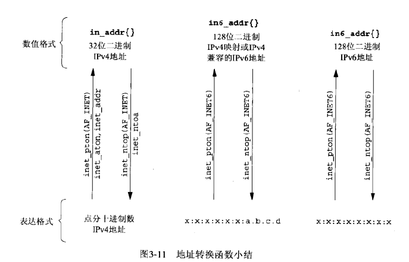

## <center>套接字编程简介</center>

### 套接字地址
* ipv4套接字地址结构
  所有套接字地址结构大小至少是16字节的
```c
#include<netinet/in.h>
struct in_addr{
	in_addr_t s_addr;
}

struct sockaddr_in{
	uint8_t        sin_len; //length of structure,无符号短整数
	sa_family_t    sin_family; // AT_INET
	in_port_t      sin_port;
	struct in_addr sin_addr;//网络字节数存储
	char           sin_zero[8]  //unused
}
```
sin_addr 字段是一个结构，而in_addr_t 是无符号长整数
结构本身不在主机之间传递



* 通用套接字地址结构
```c
#include <sys/socket.h>
struct sockaddr{
	uint8_t sa_len;  //1
	sa_family_t sa_family; //1
	char sa_data[14]; //protocal-specific address 
	                  //sin_port(2) + sin_addr(4) + sin_zero(8)
}

int bind(int,struct sockaddr *,socklen_t)
//需要对指向特定于协议的套接字地址结构的指针进行强制类型装换，变成指向某个通用套接字地址机构的地址
struct sockaddr_in serv
bind(sockfd,(struct sockaddr *)&serv,sizeof(serv));//特殊转换为通用
```

* ipv6套接字地址结构
```c
#include <netinet/in.h>
struct in6_addr{
	uint8_t s6_addr[16]; //128-bit IPV6 address
}
#define SIN6_LEN

struct sockaddr_in6
{
    uint8_t          sin6_len;     //length of this struct [28]
    sa_family_t      sin6_family;  //AF_INET6 [8]
    in_port_t        sin6_port;    //transport layer port [16]
                                   //network byte ordered
    uint32_t         sin6_flowinfo;//flow information,undefined [32]
    struct in6_addr  sin6_addr;    //IPV6 address
                                   //network byte ordered
    uint32_t         sin6_scope_id;//set of interfaces for a scope

}

```

  - sin6_flowinfo 字段分成两个字段
    - 低序20位是流标
    - 高序12位保留

* 通用套接字地址结构
```c
#include <netinet/in.h>
struct sockaddr_storage{
	uint8_t       ss_len;
	sa_family_t   ss_family;
}
```



### 值-结果参数

>> 从进程传递到内核
- bind
- connect
- sendto

```c
struct sockaddr_in serv

connect(sockfd,(sockaddr *)&serv,sizeof(serv));
```



>> 从内核传递到进程,值结果参数，传递指针是需要返回
- accept
- recvfrom
- getsockname
- getpeername
```c
struct sockaddr_un cli;
socklen_t len;

len = sizeof(cli);
getpeername(unixfd,(SA*)&cli,&len); //获取与某个套接字管关联的外地协议地址
```


### 字节排序函数
* 经常使用的是大端字节序

* 网际协议使用大端字节序来传递这些多字节整数
* 在主机字节序和网络字节序之间相互转换
```c
#include <netint/in.h>
uint16_t htons(uint16_t host16bitvalue);
uint32_t htonl(uint32_t host32bitvalue);//均返回：网络字节序的值
uint16_t ntohs(uint16_t net16bitvalue);
uint32_t ntohl(uint32_t net32bitvalue); //均返回：主机字节序的值

// h:host,n:network,s:short,l:long  现在s视为16bits,l视为32bits
```

### 字节操纵函数

```c
//Berkeley
#include <strings.h>
void bzero(void *dest,size_t nbytes);
void bcopy(const void *src,void *dest,size_t nbytes);
int bcmp(const void *ptr,const void *ptr2,size_t nbytes);//若相等则为0，否则非0

//ANSI C 
#include <string.h>
void *memset(void *dest,int c,size_t len);
void *memcpy(void *dest,const void *src,size_t len);//dest =  src
memmove() //当源字节串与目标字节串重叠时，memcpy不能正确处理，bcopy可以
int memcmp(const void *ptr1,const void *ptr2,size_t nbytes);//若相等则为0否则非0

//将32位的网络字节序二进制ipv4与相应的点分十进制数串装换
#inclue <arpa/inet.h> 
int inet_aton(const char *strptr,struct in_addr *addrptr);
                       //返回，若字符串有效为1，否则为0
in_addr_t inet_addr(const char *strptr);
//返回:若字符串有效则为32位二进制网络字节序的IPV4地址，否则为INADDR_NONE
char *inet_ntoa(struct in_addr inaddr);


//p:presentation  n:numeric
#include <arpa/inet.h>

#include <netinet/in.h> 
#define INET_ADDRSTRLEN 16 //IPV4
#define INET6_ADDRSTRLEN 46 //IPV6

int inet_pton(int family,const char *strptr,void * addrptr);
             //返回：若成功则为1，若输入不是有效的表达格式则为0，若出错则为-1
const char *inet_ntop(int family,const void *addrptr,char *strptr,size_t len);
             //返回：若成功则为指向结果的指针，若出错则为NULL 
//不支持的family，errno = EAFNOSUPPORT
//len太小，返回空指针，并置errno = ENOSPC
```


```c
int inet_pton(int family,const char *strptr,void *addrptr)
{
    if(family==AF_INET){
      struct in_addr in_val;
      if(inet_aton(strptr,&in_val)){
         memcpy(addrptr,&in_val,sizeof(struct in_addr));
         retrun (1);
      }
      return(0);
    }
    errno = EAFNOSUPPORT;
    return (-1);
}

const char * inet_ntop(int family,const void *addrptr,char *strptr,size_t len)
{
      const u_char *p = (const u_char *)addrptr;
      if(family == AF_INET){
           char temp[INET_ADDRSTRLEN];
           snprintf(temp,sizeof(temp),"%d.%d.%d.%d",p[0],p[1],p[2],p[3]);
           if(strlen(temp)>=len){
              errno = ENOSPC;
              return (NULL);
           }
           strcpy(strptr,temp);
           return (strptr);
      }
      errno = EAFNOSUPPORT;
      return (NULL);
}
```

### readn,writen,readline函数
```c
//被中断继续
// ssize_t readn(int fd,void *vptr,size_t n)
// {
//     size_t nleft;
//     ssize_t nread;
//     char *ptr;
//     ptr = vptr;
//     nleft = n;
//     while(nleft > 0)
//     {
//        if((nread = read(fd,ptr,nleft))<0)
//        {
//            if(errno == EINTR)
//               nread = 0;
//            else
//               return (-1);
//        }else if(nread ==0)
//            break;
//        nleft -=nread;
//        ptr   +=nread;
//     }
//     return (n-nleft);
// }
//被中断会返回目前读的字节数
ssize_t readn(int fd,void *vptr,size_t n)
{
    size_t nleft;
    ssize_t nread;
    char *ptr;
    ptr = vptr;
    nleft = n;
    while(nleft > 0)
    {
       if((nread = read(fd,ptr,nleft))<0)
       {
           if(nleft == n)
              return(-1);/* error,return -1 */
           else
              break; / * error ,return amount read so far */
       }else if(nread ==0)//EOF
           break;
       nleft -=nread;
       ptr   +=nread;
    }
    return (n-nleft);
}
//被中断会继续
// ssize_t writen(int fd,const void *vptr,size_t n)
// {
//     size_t nleft;
//     ssize_t nwritten;
//     const char * ptr;
//     ptr = vptr;
//     while(nleft>0){
//        if((nwritten=write(fd,ptr,nleft))<0){//被阻塞了
//            if(nwritten<0 && errno ==EINTR)
//               nwritten = 0;
//            else 
//               return (-1);
//        }
//        nleft -= nwritten;
//        ptr   += nwritten;
//    }
//    return (n);
// }

//被中断会返回已读字数
ssize_t writen(int fd,const void *vptr,size_t n)
{
    size_t nleft;
    ssize_t nwritten;
    const char * ptr;
    ptr = vptr;
    while(nleft>0){
       if((nwritten=write(fd,ptr,nleft))<0){//被阻塞了
           if(nleft==n)
             return(-1);
           else 
             break;
       }else if(nwritten == 0)
          break;
       nleft -= nwritten;
       ptr   += nwritten;
   }
   return (n);
}

//从一个描述符读文本行，一次1个字节
ssize_t readline(int fd,void *vptr,size_t maxlen)
{
    ssize_t n,rc;
    char c,*ptr;
    ptr = vptr;
    for(n=1;n<maxlen;n++){
       again:
          if((rc=read(fd,&c,1))==1){
             *ptr++=c;
             if(c=='\n') 
               break; //newline is stored,like fget
          }else if(rc==0){
              *ptr = 0;
              return (n-1); //EOF,n-1 bytes were read
          }else{
              if(errno == EINTR)
                 goto again;
              return (-1);//error,errno set by read()
          }
    }
    *ptr = 0; //null terminate like fgets
    return(n);
}
```

```c
#include "unp.h"
static int read_cnt;
static char *read_ptr;
static char read_buf[MAXLINE];

static ssize_t my_read(int fd,char *ptr)
{
    if(read_cnt<=0){
       again:
         if((read_cnt=read(fd,read_buf,sizeof(read_buf)))<0){
            if(errno == EINTR)
               goto again;
            return (-1);
         }else if(read_cnt == 0)
            return (0);
          read_ptr = read_buf;
    }
    read_cnt--;
    *ptr = *read_ptr++;
    return (1);
}

ssize_t readline(int fd,void *vptr,size_t maxlen)
{
    ssize_t n,rc;
    char    c,*ptr;
    ptr = vptr;
    for(n=1;n<maxlen;n++){
       if((rc=my_read(fd,&c))==1){
         *ptr++ = c;
         if(c=='\n')
           break;
           }else if(rc ==0){
             *ptr = 0;
             return(n-1);
           }else 
              return (-1);
    }
    *ptr = 0;;
    return(n);
}

ssize_t readlinebuf(void **vptrptr)
{
	if(read_cnt)
	  *vptrptr = read_ptr;
	return(read_cnt);
}
```