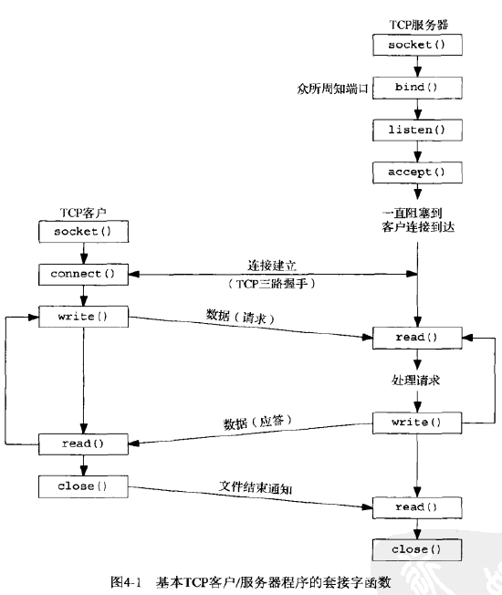
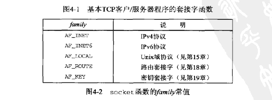
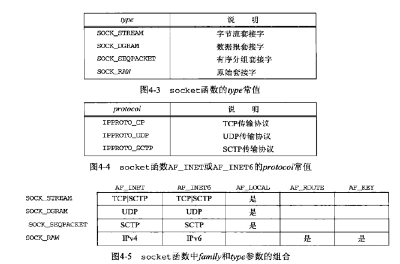
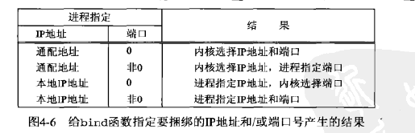
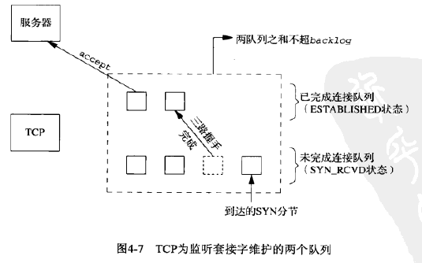
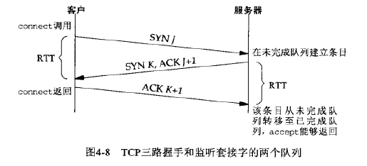
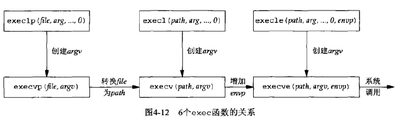
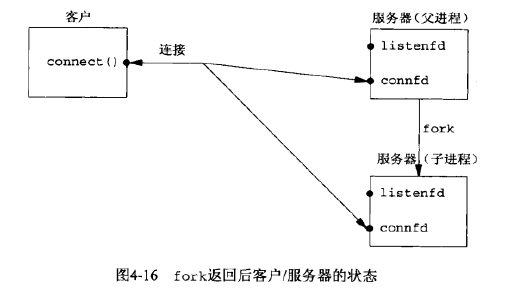
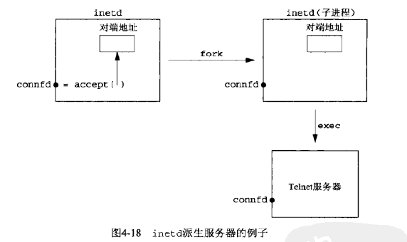

## <center>基本TCP套接字编程</center>

### socket函数
```c
#include <sys/socket.h>
int socket(int family,int type,int protocol);
          //返回：若成功则为非负描述符，套接字描述符，sockfd,若出错则为-1
```







* AF_XXX 是地址簇
* PF—XXX 是协议簇

### connect函数
* TCP客户用connect函数来建立与TCP服务器的连接
```c
#include <sys/socket.h>
int connect(int sockfd,const struct sockaddr *servaddr,socklen_t addrlen);
   //返回：若成功为0，若出错为-1
```
* 如果是tcp套接字，调用connect函数将激发tcp的三路握手过程，而仅在连接建立成功或者出错时才返回，其中出错返回可能有以下几种情况
  - ETIMEDOUT:tcp客户没有收到SYN分节的响应
  - ECONNREFUSED:对客户的SYN的响应是RST(表示复位)，表明在该服务器主机在我们指定地点端口上没有进程在等待与之连接，硬错误
     -  目的地为某端口的SYN到达，然而该端口上没有正在监听的服务器
     -  TCP想取消一个已有连接
     -  TCP接受到一个根本不存在的连接上的分节
  - 软错误，EHOSTUNREACH 或 ENETUNREACH
    SYN在某个路由器上引发一个'destination unreachable' ICMP错误
* 连接失败后必须关闭套接字

### bind 函数
* 把一个本地协议地址赋予一个套接字
```c
#include <sys/socket.h>
int bind(int sockfd,const struct sockaddr *myaddr,socklen_t addrlen);
```
* 如果TCP服务器没有把IP地址捆绑到它的套接字上，内核就把客户发送的SYN的目的IP地址作为服务器的源IP地址


* 对IPV4来说，通配地址由常值INADDR_ANY来指定，其值一般为0
* 对IPV6系统预先分配in6addr_any变量并将其初始化为常值IN6ADDR_ANY_INIT,头文件<netinet/in.h>中含有in6addr_any的extern声明
* bind并不返回所选择的值，为了得到内核选择的这个临时端口值，必须调用函数getsockname来返回协议地址
```c
struct sockaddr_in servaddr;
servaddr.sin_addr.s_addr = htonl(INADDR_ANY);

struct sockaddr_in6 serv;
serv.sin6_addr = in6addr_any;
```

### listen
* listen函数仅有TCP服务器调用，它做两件事情
  -  CLOSE -> LISTEN
  -  第二个参数规定内核应该为相应套接字排队的最大连接个数
     ```c
     #include <sys/socket.h>
     int listen(int sockfd,int backlog)
                       //若成功则为0，出错为-1
     ```
* 内核为任何一个给定的监听套接字维护两个队列
  -  未完成队列 SYN_RCVD
  -  已完成连接队列 ESTABLISHED状态
  
  

* 在三路握手正常完成的前提下(没有丢失分节没有重传)未完成连接队列中的任何一项在其中的存留时间就是一个RTT
```c
void Listen(int fd,int backlog)
{
   char *ptr;
   if((ptr=getenv("LISTENQ"))!=NULL)
      backlog = atoi(ptr);
   if(listen(fd,backlog)<0)
      err_sys("Listen error");
}
```

### accept函数
* accept函数由TCP服务器调用，用于从已完成连接队列头返回下一个个已完成连接。如果已完成连接队列为空，那么进程被投入睡眠
* cliaddr和addrlen用来返回已连接的对端进程(客户)的协议地址
* 一个服务器通常仅创建一个监听套接字，
* 客户为每个由服务器进程接受的客户连接创建一个已连接套接字
* 已连接套接字每次都在循环中关闭
```c
#include <sys/socket.h>
int accept(int sockfd,struct sockaddr *clidaar,cocklen_t *addrlen);
       //返回：若成功则为非负描述符，若出错则为-1
```

* bind 函数必须用超级用户权限运行

### fork 和exec 函数
* 父进程中调用fork之前打开的所有描述符在fork返回后由子进程分享
```c
#include <unistd.h>
pid_t fork(void);//返回：在子进程中为0，在父进程中为子进程ID，若出错为-1
```

* 6个exec函数之间的区别在于
  - 待执行的程序文件是由文件名还是路径名指定
  - 新程序的参数是一一列出还是由一个指针数组来引用
  - 把调用进程的环境传递给新程序还是给新程序指定新的环境
  - 一般来说，只有execve是内核中的系统
  - 上面3个每个参数字符串指定成exec的一个独立参数，并以空指针结束可变数量的参数
  - 左列2个指定filename，使用当前的path环境变量转换为路径，有 / 不再使用path
    右两列4个函数指定一个全限定的pathname参数
  - 左两列4个不显示指定环境指针，使用外部变量environ的当前值来构造一个传递给新程序的环境列表
  - 在调用exec之前打开的描述符通常跨exec继续保持打开，也可通过fcntl设置FD_CLOEXEC描述符禁止掉
```c
//均返回：若成功则不返回，若出错则为-1
#include <unistd.h>
int execl(const char *pathname,const char *arg0,...);
int execv(const char *pathname,char *const *argv[]);
int execle(const char *pathname,const char *arg0,...)
int execve(const char *pathname,char *const argv[],char *const envp[]);
int execlp(const char *filename,const char *arg0,...);
int execvp(const char *filename,char *const argv[]);
```


```c
pid_t pid;
int listenfd,connfd;
listenfd = Socket(...);
Bind(listenfd,...);
Listen(listenfd,LISRENQ);
for(;;){
	connfd = accept(listenfd,...);
	if((pid=fork())==0){
       close(listenfd);
       doit(connfd);
       close(connfd);
       exit(0);
    }
    close(connfd);
}
```
* 连接 引用计数




### close函数
* 关闭套接字，终止TCP连接
```c
#include <unistd.h>
int close(int sockfd);
```

### getsockname和getpeername函数
* getsockname 返回与某个套接字关联的本地协议地址
 - 没有bind的TCP客户机上，connect成功后，getsockname用于返回由内核赋予该连接的本地IP地址和本地端口号
 - 在以端口号0调用bind后，getsockname用以返回由内核赋予的本地端口号
 - getsockname可用于获取某个套接字的地址族
   ```c
   int sockfd_to_family(int sockfd)
   {
      struct sockaddr_storage ss;
      socklen_t len;
      len = sizeof(ss);
      if(getsockname(sockfd,(SA *)&ss,&len)<0)
         return(-1);
      return (ss.ss_family);
   }
   ```
* getpeername 返回与某个套接字关联的外地协议地址
  - fork后调用exec执行程序是，能够获取客户身份的唯一途径

```c
#include<sys/socket.h>
int getsockname(int sockfd,struct sockaddr *localaddr,socklen_t *addrlen);
int getpeername(int sockfd,struct sockaddr *perraddr,socklen_t *addrlen);
```


### 
* send时套接字必须已经连接
* sendto 可以在无连接的套接字上指定一个目标地址
* 连接中隐含了目标地址
* 对于支持报文边界的协议，如果尝试发送的单个报文的长度超过协议所支持的最大长度，那么send会失败，并将errno设为EMSGSIZE
* 对于字节流协议，send会阻塞直到整个数据传输完成