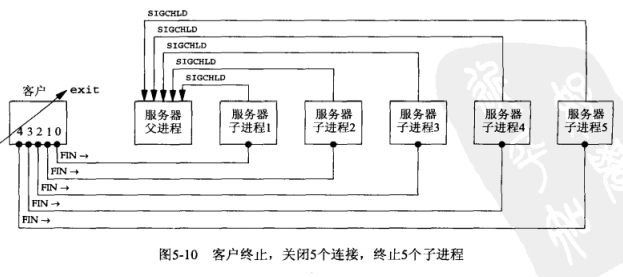
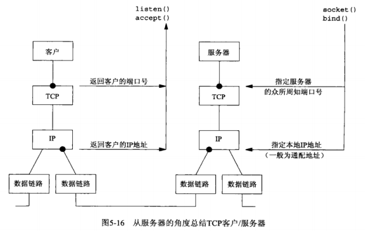

## <center>TCP客户/服务器程序示例</center>

### 代码

[server.c](../server.c)

[client.c](../client.c)

### POSIX信号处理
* sigaction函数
* SIGCHLD 信号就是由内核在任何一个进程终止时发送给它的父进程的一个信号
* SIGKILL,SIGSTOP 不能被捕获,也不能被忽略-SIG_IGN
* 信号捕获函数
  - 单一整数调用
  - 没有返回值
  - 原型 `void handler(int signo)`
* POSIX保证被捕获的信号在其信号处理函数运行期间总是阻塞的

### wait 与 waitpid 函数
```c
#include <sys/wait.h>
pid_t wait(int *statloc);
pid_t waitpid(pid_t pid,int *statloc,int options);
//返回：成功返回进程id，若出错则为0或-1
```
* 返回已终止进程的id号，以及通过statloc指针返回的子进程终止状态
* wait阻塞到现有子进程第一个终止为止
* pid指定想等待的进程ID，值-1表示等待第一个终止的子进程
* WNOHANG 没有已终止进程时不要阻塞
* Unix信号是不排队的


```c
void sig_chld(int signal)
{
	pid_t pid;
	int stat;
	//pid = wait(&stat);//wait取到子进程的pid和终止状态 
	while((pid=waitpid(-1,&stat,WNOHANG))>0)
	  printf("child %d terminated\n",pid);
	return;
}
```

### 数据格斯
* 不同的实现以不同的格式存储二进制，最常见的是打断字节序贺小端字节序
* 不同的实现在存储相同的C数据类型上可能存在差异
* 不同的实现给结构打包的方式存在差异，取决于各种数据类型所用的位数以及机器的对其限制

* 解决方式
  - 把所有的数值数据作为文本串来传递
  - 显示定义所支持数据类型的二级制格式(位数、大端、或小端字节序)，并以这样的格式在客户贺服务器之间传递所有数据，例如RPC

### 总结




### 习题
5.4 杀死已连接进程服务器，服务器发送FIN，客户返回ACK及FIN，但是服务器不会收到？如果客户继续调用，服务器返回RST？后半部分(来自客户的FIN和来自服务器的对该分节ACK)会交换吗？
5.6
5.7
5.8
5.9
