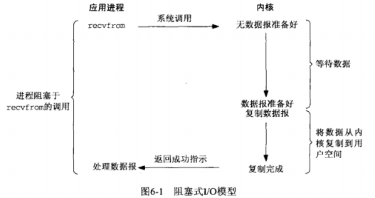
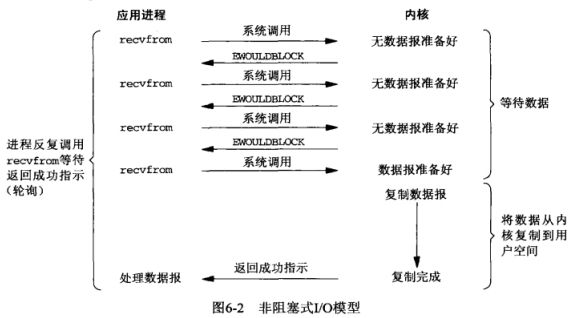
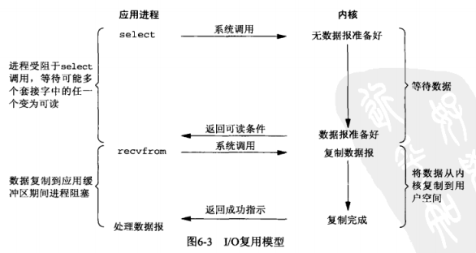
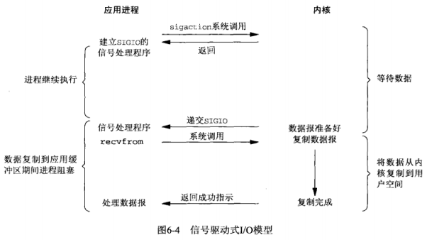
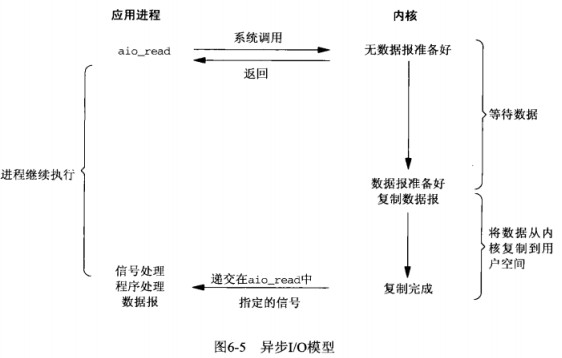
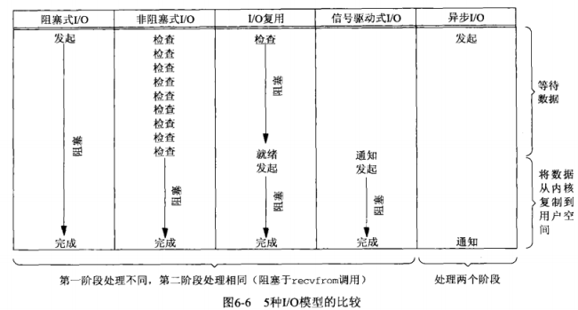
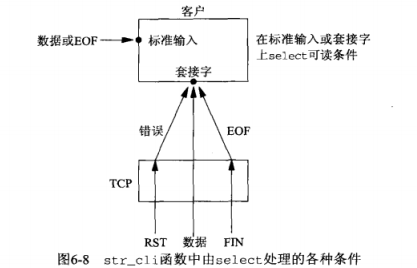
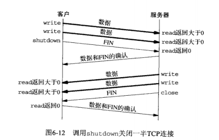

## <center> I/O复用：select和poll函数</center>

* 问题：客户同时处理两个输入(标准输入和TCP套接字)，但是会被阻塞到标准输入
* I/O复用：进程需要一种预先告知的能力，使得内核一旦发现进程指定的一个或多个I/O条件就绪(也就是说输入已经准备好被读取或者描述符已经能承接更多的输入)，他就通知进程。由select和poll这两个函数支持的

## I/O模型

### 阻塞式I/O模型


### 非阻塞式I/O模型
* 进程把一个套接字设置成非阻塞是在通知内核：当所请求的I/O操作非得把本进程投入睡眠才能完成时，不要把本进程投入睡眠，而是返回一个错误


### I/O复用模型
* 可以调用select或poll，阻塞在这两个系统调用中的某一个之上，而不是阻塞在真正的I/O系统调用上
* 阻塞与select调用，等待数据报套接字变为可读


### 信号驱动式I/O模型
* 通过sigaction系统调用安装一个系统处理函数
* 在等待数据表到达期间进程不会阻塞，主循环可以继续执行


### 异步I/O模型
* 告知内核启动某个操作，并让内核在整个操作(包括将数据从内核复制到我们自己的缓冲区)完成后通知我们。
* 信号驱动式由内核通知我们合适可以启动一个I/O操作。而异步I/O模型是由内核通知我们I/O操作何时完成
、

###  模型比较
* 前四种模型都是同步I/O模型，因为其中真正的I/O操作将阻塞进程，只有异步I/O模型与POSIX定义的异步I/O相匹配


### select
* 运行进程指示内核等待多个事件中的任何一个发生，并只有在有一个或多个实践发生或经历一段指定时间后才唤醒它

```c
#include <sys/select.h>
#include <sys/time.h>

struct timeval {
    long tv_sec;
    long tv_usec;
}

void FD_ZERO(fd_set *fdset);
void FD_SET(int fd,fd_set *fdset); //turn on the bit for fd in fdset
void FD_CLR(int fd,fd_set *fdset); //turn off the bit for fd in fdset
int FD_ISSET(int fd,fd_set *fdset);

int select（int maxfdp1,fd_set *readset, fd_set *writeset,fd_set *exceptset,const struct timeval *timeout );
//返回：若有就绪描述符则为其数目，若超时则为0，若出错则为-1

fd_set rset;
FD_ZERO(&rset);
FD_SET(1,&rset);
FD_SET(4,&rset);
FD_SET(5,&rset);

```

* timeval
  - 永远等待下去：仅在有一个描述符准备好I/O时才返回，该参数定义为空指针
  - 等待一段固定时间
  - 根本不等待：检查描述符后立即返回，称为轮询(polling) 定时器为0

* 目前支持的一次条件只有两个：
  - 某个套接字的带外数据的到达
  - 某个已置为分组模式的为终端存在可从其主端读取的控制状态信息

* fd_set   
  描述符集，通常是一个整数数组，其中每个整数中的每一位对应于一个描述符。

* maxfdp1  
  - 指定待测试的描述符个数，它的值是待测试的最大描述符加1
  - <sys/select.h>中定义的FD_SETSIZE常值是数据类型fd_set中描述符总数

* 当某个套接字上发生错误时，它将由select标记为即可读又可写


### str_cli

```c
void str_cli(FILE *fp, int sockfd)
{
  int maxfdp1;
  fd_set rset;
  char sendline[MAXLINE], recvline[MAXLINE];

  FD_ZERO(&rset);
  for (;;)
  {
    FD_SET(fileno(fp), &rset);
    FD_SET(sockfd, &rset);
    maxfdp1 = MAX(fileno(fp), sockfd) + 1;
    select(maxfdp1, &rset, NULL, NULL, NULL);

    if (FD_ISSET(sockfd, &rset))
    {
      if (readline(sockfd, recvline, MAXLINE) == 0)
      {
        perror("str_cli:server terminated prematurely");
        exit(0);
      }
      fputs(recvline, stdout);
    }
    if (FD_ISSET(fileno(fp), &rset))
    {
      if (fgets(sendline, MAXLINE, fp) == NULL)
        return;
      writen(sockfd, sendline, strlen(sendline));
    }
  }
}
```


* 对端发送数据，改套接字变为可读，并且read返回一个大于0的值
* 如果对端TCP发送一个FIN，套接字变为可读，并且read返回0(EOF)
* 如果对端TCP发送一个RST(对端主机奔溃并重新启动)，那么该套接字变为可读，并且read返回 -1，errno中含有确切的错误码

* 问题：如果在数据任然传递的路上，或仍有应答在返回客户的路上，关闭客户端出现问题
* 想给服务器发送一个FIN，告诉它我们已经完成了数据发送，但是仍然保持套接字描述符打开以便读取
* select不知道stdio使用了缓冲，它只是从read系统调用的角度指出是否有数据可读
  readline有同样的问题

### shutdown函数
* close函数限制
  - close把描述符的引用计数减1，仅在该计数为0时才关闭套接字
  - 使用shutdown可以不管引用计数就激发TCP的正常连接终止序列
  - close终止读和写两个方向的数据传送



```c
#include <sys/socket.h>
int shutdown(int sockfd,int howto);
//返回：若成功则为0，若出错则为-1
```
* howto
 - SHUT_RD 关闭连接的读这一半 --- 套接字中不再有数据可接受，而且套接字接收缓冲区中的现有数据都被丢弃
 - SHUT_WT 关闭连接的写这一半 --- 对TCP套接字，这称为半关闭，当前留在套接字发送缓冲区中的数据将被发送掉，后跟TCP的正常连接终止序列
 - SHUT_RDWR 连接的读半部和写半部都关闭

* 当一个服务器在处理多个客户时，绝对不能阻塞于只于当个客户相关的某个函数调用
  - 使用非阻塞式I/O
  - 让每个客户由单独的控制线程提供服务
  - 对I/O操作设置一个超时


### pselect
```c
#include <sys/select.h>
#include <signal.h>
#include <time.h>

struct timespec {
  time_t tv_sec;
  long tv_nsec; // nanoseconds
}
int pselect(int maxfdp1,fd_set *readset,fd_set *writeset,fd_set *exceptset,const struct timespec *timeout,const sigset_t *sigmask);
     //返回：若有就绪描述符则为其数目，若超时为0，若出错为-1
```

* sigmask
  - 允许程序先禁止递交某些信号，再测试由这些当前被禁止信号的信号处理函数设置的全局变量，然后调用pselect,告诉他重新设置信号掩码