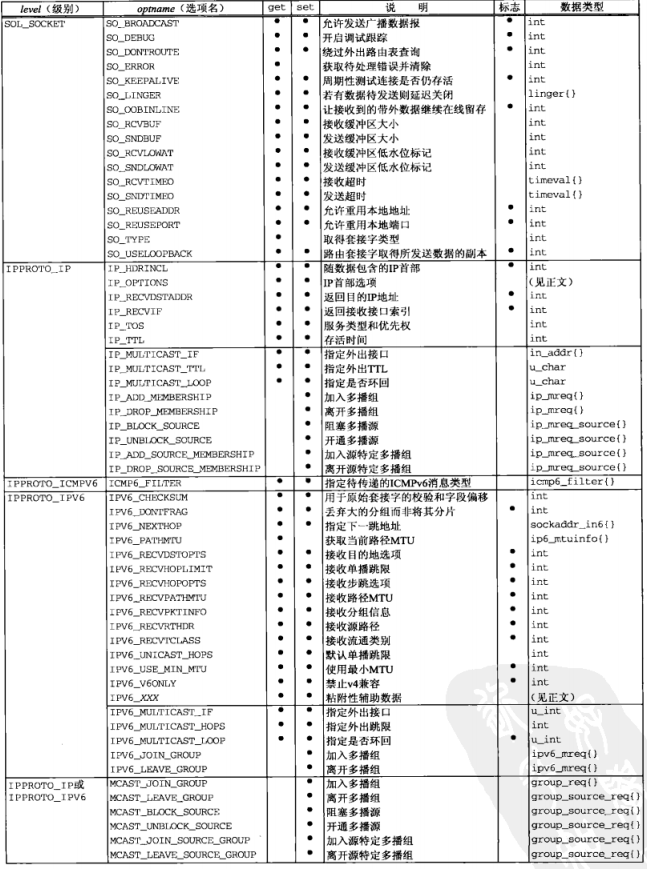
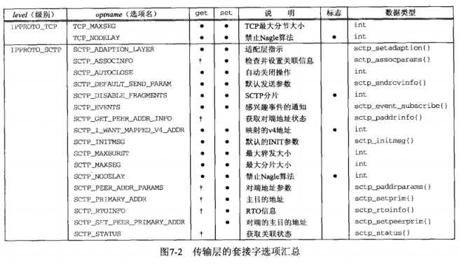
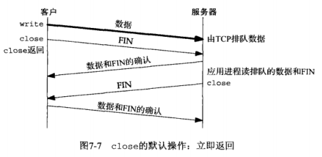
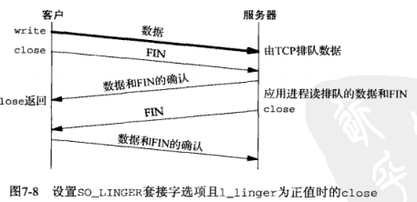
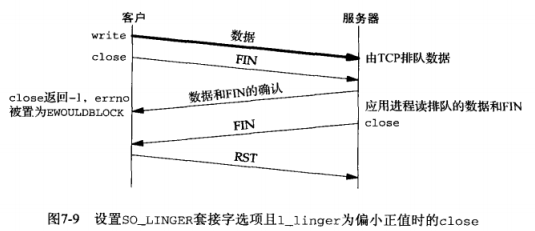
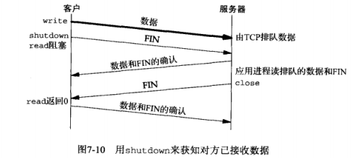
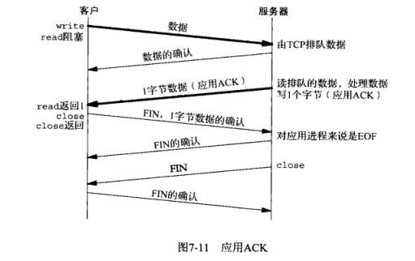
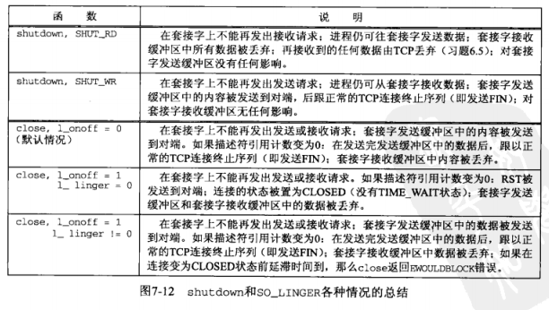
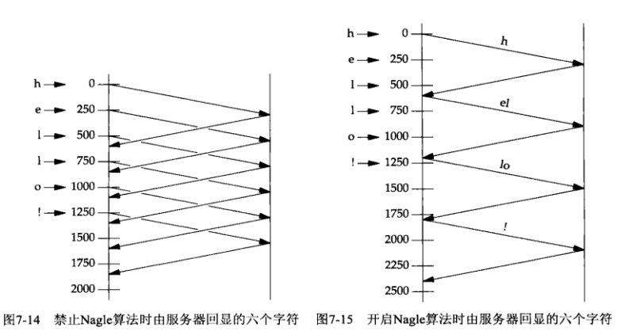
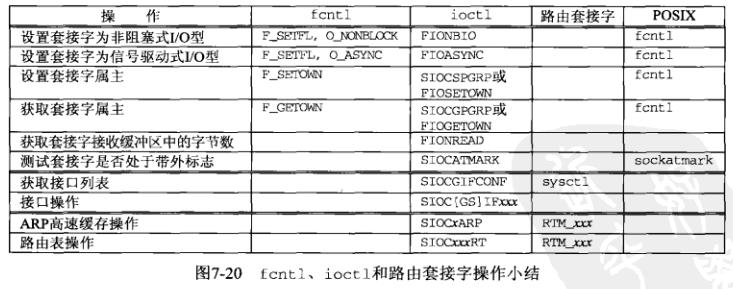

## <center>套接字选项</center>

### getsockopt 和 setsockopt
```c
#include <sys/socket.h>
int getsockopt(int sockfd,int level,int optname,void *optval,socklen_t *optlen);
int setsockopt(int sockfd,int level,int optname,const void *optval,socklen_t optlen);
//均返回：若成功则为0，若出错则为-1
```

* sockfd 必须指向一个打开的套接字描述符
* level(级别)指定系统中解释选项的代码或为通用套接字代码，或为某个特定于协议的代码
* optval是一个指向某个变量(* optval)的指针
* setsockopt从 * optval中取得选项待设置的新值
* getsockopt则把已获取的选项当前值存放到 * optval中
* * optval的大小由最后一个参数指定
* 套接字选项粗分为两大基本类型：
  - 启用或禁止某个特性的二元选项(标志选项)
  - 取得并返回我们可以设置或检查的特定值的选项(值选项)




### 检查选项是否受支持并获取默认值
[checkopts](../checkopts.c);

### 套接字状态
* 由TCP已连接套接字从监听套接字继承来
   - SO_DEBUG
   - SO_DONTROUTE
   - SO_KEEPALIVE
   - SO_LINGER
   - SO_OOBINLINE
   - SO_RCVBUF
   - SO_RCVLOWAT
   - SO_SNDBUF
   - SO_SNDLOWAT
   - TCP_MAXSEG
   - TCP_NODELAY

### 通用套接字
* 协议无关的
* SO_DONTROUTE
* SO_DEBUG
  - 当给一个TCP套接字开启本选项时，内核将为TCP在该套接字发送和接收的所有分组保留详细跟踪信息

* SO_DONTROUTE 
  - 规定外出的分组绕过底层协议的正常路由机制
* SO_ERROR
  - 内核能够以下面两种方式之一立即通知进程这个错误
    - 如果进程阻塞在对该套接字的select调用上，那么无论是检查可读条件还是可写条件，select均返回并设置其中一个或所有两个条件
    - 如果进程使用信号驱动是I/O模型，那就给进程或进程组产生一个SIGIO信号
  - 一个套接字上出现的待处理错误一旦返回给用户进程，它的so_error就得复位为0
* SO_KEEPALIVE
   - 如果2小时内在该套接字的任一方向没有数据交换，TCP就自动给对端发送一个`保持存活探测分节`。

   - 对端以RST响应，它告知本端TCP：对端已崩溃重启动，该套接字的待处理错误被置为ECONNRESET,套接字本身则被关闭

   - 对端对保持存活探测分节没有任何响应。在规定时间内没得到任何响应则放弃

   

* SO_LINGER
  - 指定close函数对面向连接的协议如何操作。默认是close立即返回，但是如果有数据残留在套接字发送缓存区中，系统将试着把这些数据发送给对端
  ```c
  struct linger{
  	int l_onoff;/*o-off,nonzero=on*/
  	int l_linger;/*linger time,POSIX specifies units as seconds*/
  }
  ```

  - 如果 l_onoff为0，那么关闭本选项
  - 如果 l_onoff为非0且 l_linger为0，那么当close某个连接时TCP将中止该连接。即TCP将丢弃保留在套接字发送缓冲区中的任何数据，并发送一个RST给对端，并没有通常的四分组连接终止序列
  - 如果l_onoff为非0且l_linger也为非0，那么当套接字关闭时内核将拖延一段时间。如果在套接字发送缓冲区中仍残留有数据，那么进程将被投入睡眠，知道所有数据都已发送完且均被对方确认或延滞时间到(EWOULDBLOCK,残留数据被丢弃)
  - shutdown(并设置第二个参数为SHUT_WR)，等到接受了对端的FIN才返回
  

  

  

  

  ```c
  //应用级确认
  char ack;
  write(sockfd,data,nbytes);
  n = read(sockfd,&ack,1);


  nbytes = read(sockfd,buff,sizeof(buff));
  write(sockfd,"",1);
  ```

  

  

* SO_OOBINLINE
  - 当本选项开启时，带外数据将被留在正常的输入队列中(即在线留存)

* SO_RCVBUF 和 SO_SNDBUF
  - 接收缓冲区被TCP、UDP和SCTP用卡保存接收到的数据，知道由应用进程来读取
  - 这两个套接字选项允许我们改变这两个缓冲区的大小。
  - TCP的窗口规模选项是在建立连接时用SYN分节与对端互换得到的
  - 对于客户，SO_RCVBUF选项必须在调用connect之前设置
  - 对于服务器，这意味着该选项必须在调用listen之前给监听套接字设置
  - 所以必须给监听套接字设置本选项
  - TCP套接字缓冲区的大小至少应该是相应连接的MSS值的四倍，根据TCP快速算法的工作机制


  - 管道的容量称为带宽-延迟积，它通过将带宽和RTT(往返时延)相乘，再将结果由位转换为字节计算得到

* SO_RCVLOWAT 和 SO_SNDLOWAT 套接字选项
  - 接收低水位标记和发送低水位标记，由select函数使用
  - 接收低水位标记是让select返回“可读”时套接字接收缓冲区中所需的数据量，对TCP、UDP和SCTP套接字，其默认值为1
  - 发送低水位标记是让select返回“可写”时套接字发送缓冲区中所需的可用空间，TCP默认2048

* SO_RCVTIMEO和SO_SNDTIMEO 套接字选项
  - 这两个选项允许我们给套接字的接收和发送设置一个套接字
  - 接收超时影响5个输入函数：read、readv、recv、recvfrom、recvmsg
  - 发送超时影响5个输出函数：write、writev、send、sendto、sendmsg


### TCP套接字选项
* 级别 IPPROTO_TCP
* TCP_MAXSEG 
  - 获取或设置TCP连接的最大分节大小(MSS),返回值是我们的TCP可以发送给对端的最大数据量，它通常是由对端使用SYN分节通告的MSS

* TCP_NODELAY 
  - 开启本选项将禁止TCP的Nagle算法，默认是该算法是开启的
  - Nagle算法的目的在于减少广域网(WAN)上小分组的数目，如果某个给定连接上有待确认数据，那么原本应该作为用户写操作之响应的在该连接上立即发送相应小分组的行为就不会发生，直到现有数据被确认为止。
  - 小分组：定义为小于MSS的任何分组
  - Nagle算法常常和另一个TCP算法联合使用：ACK延迟算法
  - ACK延迟算法：该算法使得TCP接收到数据后不立即发送ACK，而是等待一小段时间(典型值为50 ~ 200ms)，然后才发送ACK。TCP期待在这一小段时间内自身有数据发送回对端，被延滞的ACK就可以由这些数据捎带，从而省掉一个TCP分节。
  - 不适合Nagle算法和TCP延滞算法的客户是以若干小片数据向服务器发送单个逻辑请求的客户
  - 修正上面的问题
    - 使用writev,TCP输出功能一次而不是两次，只产生一个TCP分节
    - 把两部分数据复制到单个缓冲区中，然后对该缓冲区调用一次write
    - 设置TCP_NODELAY，不可取
  



### fcntl函数



* 前6个操作可由任何进程应用于套接字
* 后两个操作由诸如ifconfig和route之类管理程序执行
* fcntl函数提供了与网络编程相关的如下特性
  - 非阻塞式I/O，通过使用 F_SETFL命令设置O_NONBLOCK文件标志
  - 信号驱动式I/O。通过使用F_SETFL命令设置O_ASYNC文件标志，SIGIO信号
  - F_SETOWN命令允许我们指定用于接收SIGIN和SIGURG信号的套接字属主(进程ID或进程组ID)
     - SIGIO 设置为信号驱动式I/O型后产生
     - SIGURG 信号是在新的带外数据到达套接字时产生
     - F_GETOWN命令返回套接字的当前属主

```c
#include <fcntl.h>
int fcntl(int fd,int cmd,.../*int arg*/);
//若成功，则取决于cmd,若出错则为-1


//正确开启非阻塞式I/O的典型代码
int flag;
if((flag=fcntl(fd,F_GETFL,0))<0)
    err_sys("F_GETFL error");
flag |= O_NONBLOCK;
if(fcntl(fd,F_SETFL,0)<0)
     err_sys("F_SETFL eror");


//正确关闭非阻塞标志
flag & = ~O_NONBLOCK;
if(fcntl(fd,F_SETFL,0)<0)
    err_sys("F_SETFL error");
```