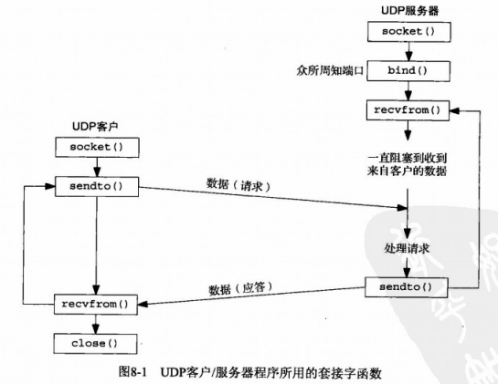
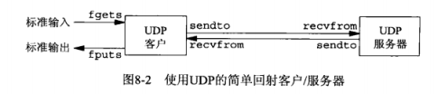
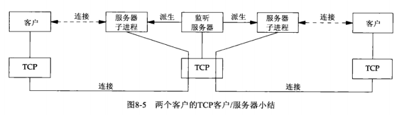
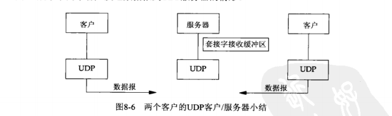
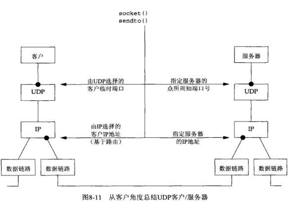
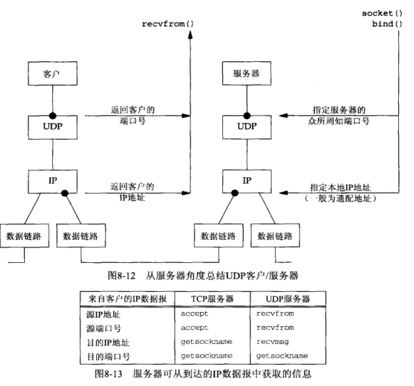
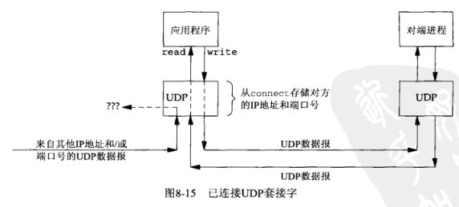
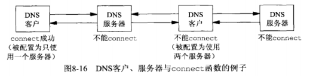

## <center>基本UDP套接字编程</center>



### recvfrom和sendto函数

```c
#include <sys/socket.h>
ssize_t recvfrom(int sockfd,void *buff,size_t nbytes,int flags,struct sockaddr *from,socklen_t *addrlen);

ssize_t sendto(int sockfd,const void *buff,size_t nbytes,int flags,const struct sockaddr *to,socklen_t *addrlen);

//均返回：若成功则为读或写的字节数，若出错则为-1
```

* 写一个长度为0的数据报是可行的。在UDP情况下，这会形成一个只包含一个IP首部(对于IPV4通常为40字节，对于IPV6通常为40个字节)和一个8字节的UDP首部而没有数据的数据报。
* 如果recvfrom的from参数是一个空指针，那么相应的长度参数addrlen也必须是一个空指针，表示我们不关心数据发送者的协议地址



* 每个UDP套接字都有一个接收缓冲区
* 当进程调用recvfrom时，缓冲区中的下一个数据报以FIFO顺序返回给进程




* 在客户主机能够往服务器主机发送那个UDP数据报之前需要一次ARP请求和应答
  - ICMP错误为异步错误
  - UDP输出操作成功仅仅表示在接口输出队列中具有存放形成IP数据报的空间
  - 对一个UDP套接字，由它引发的异步错误却并不返回给它，除非它已连接
  - 客户的IP地址和端口号都由内核自动选择，也可以通过bind指定它们。
  - 客户的临时端口是在第一次调用sendto时一次性选定，不能改变
  - 客户的IP地址却可以随客户发送的每个UDP数据报而变动(多宿主主机)
  - 如果客户捆绑了一个IP地址到套接字上，但是内核决定外出数据表必须从另一个数据链路出发，那么将会发生什么？




  - 对于UDP套接字，目的ip地址只能通过为IPV4设置IP_RECVDSTADDR套接字选项(或为IPV6设置IPV6_PKTINFO)然后调用recvmsg取得

### udp的connect函数

* 除非套接字已连接，否则异步错误不会返回到UDP套接字的。我们确实可以给udp套接字调用connect，然而这样做的没有三路握手过程，内核只是检查是否存在 立即可知的错误
  - 未连接UDP套接字，新创建的UDP套接字默认如此
  - 已连接UDP套接字，对UDP套接字调用connect的结果

* 对已连接UDP套接字，与默认的未连接套接字相比，变化
  - 不能给输出操作指定目的IP地址和端口号，不使用sendto,而改用write或send
  - 不必使用recvfrom以获悉数据报的发送者，而改用read，recv或recvmsg
  - 由已连接UDP套接字引发的异步错误会返回给它们的进程，而未连接UDP套接字不接收任何异步错误

  

  


* DNS 


  - 通常通过在 /etc/resolv.conf文件中列出服务器主机的IP地址，一个DNS客户主机就能被配置成使用一个或多个DNS服务器

* 给一个UDP套接字多次调用connect
  - 拥有一个已连接UDP套接字的进程可出于下列两个目的再次调用connect
     - 指定新的Ip地址和端口号
     - 断开套接字 AF_UNSPEC 返回 EAFNOSUPPORT错误

* 性能
  - 在一个未连接的UDP套接字上给两个数据报调用sendto函数涉及下面6步骤
     - 连接套接字
     - 输出第一个数据报
     - 断开套接字连接
     - 连接套接字
     - 输出第二个数据报
     - 断开套接字连接
  - 调用connect后调用两次write涉及内核执行
     - 连接套接字
     - 输出第一个数据报
     - 输出第二个数据报
  - 临时连接未连接的UDP套接字大约会耗费每个UDP传输三分之一的开销

* netstat -s -p udp  //-s 统计  

### UDP套接字接收缓冲区
* 由UDP给某个特定套接字排队的UDP数据报数目受限于该套接字接收缓冲区的大小，可以使用SO_RCVBUF套接字选项修改该值
```c
  n = 220 * 1024;
  setsockopt(sockfd, SOL_SOCKET, SO_RECBUF, &n, sizeof(n));
```

### [UDP 中外出接口的确定](../udpclient1.c)
* 内核把本地IP地址指派成默认路径所指接口的主IP地址。
* 调用connect并不给对端主机发送任何信息，它完全是一个本地操作，只保存对端的IP地址和端口号
```c
//获取临时端口
#include <stdio.h>
#include <stdlib.h>
#include <string.h> //bzero
#include <sys/socket.h>
#include <arpa/inet.h>
#include <netinet/tcp.h>
#include "util.h"
#include "sock_ntop.h"
int main(int argc, char **argv)
{
  int sockfd;
  socklen_t len;
  struct sockaddr_in cliaddr, servaddr;

  if (argc != 2)
  {
    perror("usage: udpcli<IPaddress>");
    exit(1);
  }
  sockfd = socket(AF_INET, SOCK_DGRAM, 0);

  bzero(&servaddr, sizeof(servaddr));
  servaddr.sin_family = AF_INET;
  servaddr.sin_port = htons(8000);
  inet_pton(AF_INET, argv[1], &servaddr.sin_addr);

  connect(sockfd, (struct sockaddr *)&servaddr, sizeof(servaddr));
  len = sizeof(cliaddr);
  getsockname(sockfd, (struct sockaddr *)&cliaddr, &len);
  printf("local address %s\n", sock_ntop((struct sockaddr *)&cliaddr, len));
  exit(0);
}
```
### [使用select函数的TCP和UDP回射服务器程序](../udpserveselect.c)