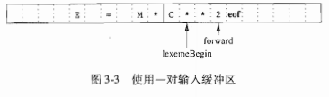
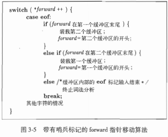
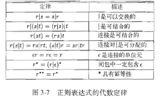

## 词法分析

[词法分析](../image/cf.png)

### 作用

* 识别词素
* 过滤掉源程序中的注释和空白(空格，换行符，制表符以及输入中用于分隔词法单元的其他字符)
* 将编译器生成的错误消息与源程序的位置联系起来

### 处理阶段
* 扫描阶段
* 词法分析阶段

### 词法单元，模式和词素

* 词法单元
  - 每个关键字有一个词法单元。一个关键字的模式就是该关键字本身
  - 表示运算符的词法单元
  - 一个表示所有标识符的词法单元
  - 一个或多个表示常量的词法单元，比如数字和字面量字符串
  - 每一个标点符号有一个词法单元

* 一个标识符的属性值是一个指向符号表中该标识符对应条目的指针


### 缓冲区对



### 哨兵标记



### 正则表达式

* 正则表达式代数定律

* 正则表达式定义的语言叫做正则集合，如果两个正则表达式r和s表示同样的语言，则称r和s等价，r=s


* 运算符
  - 一个或多个实例 +
  - 零个或一个实例 ?
  - 字符类 `[abc]`== `a|b|c` `[a-z]`==`a|b|···|z`  

```
digit -> [0-9]
digits -> digit+
number -> digits(.digits)?(E[+-]?digits)?
```